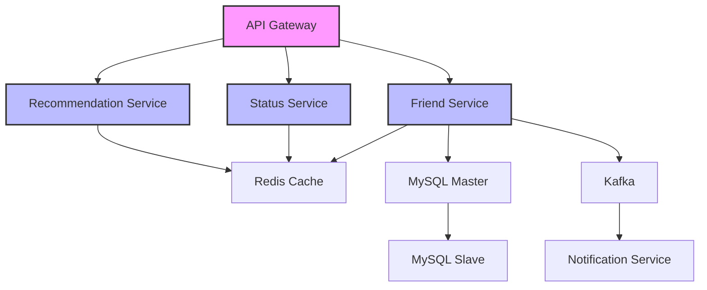
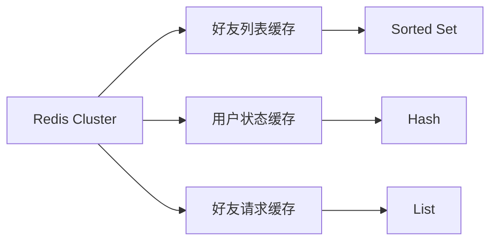
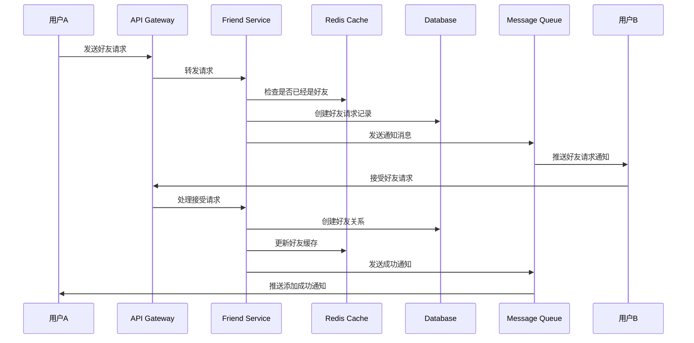
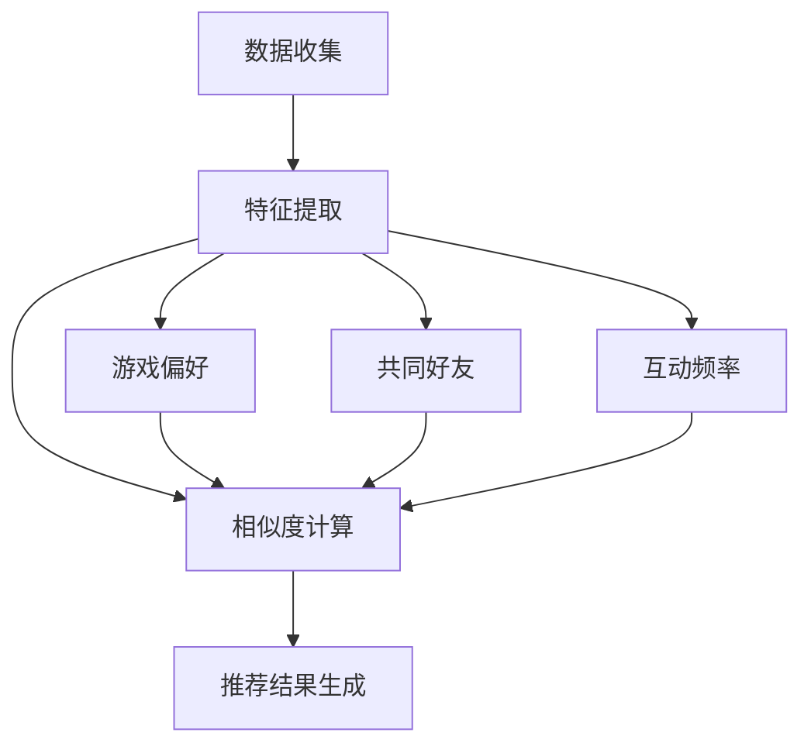
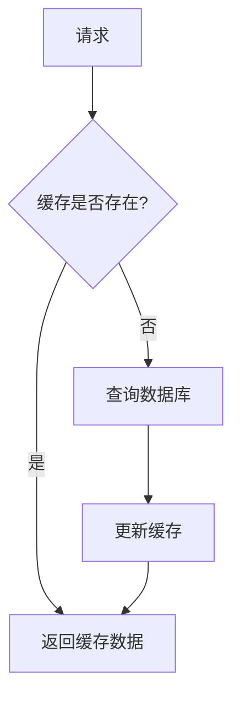
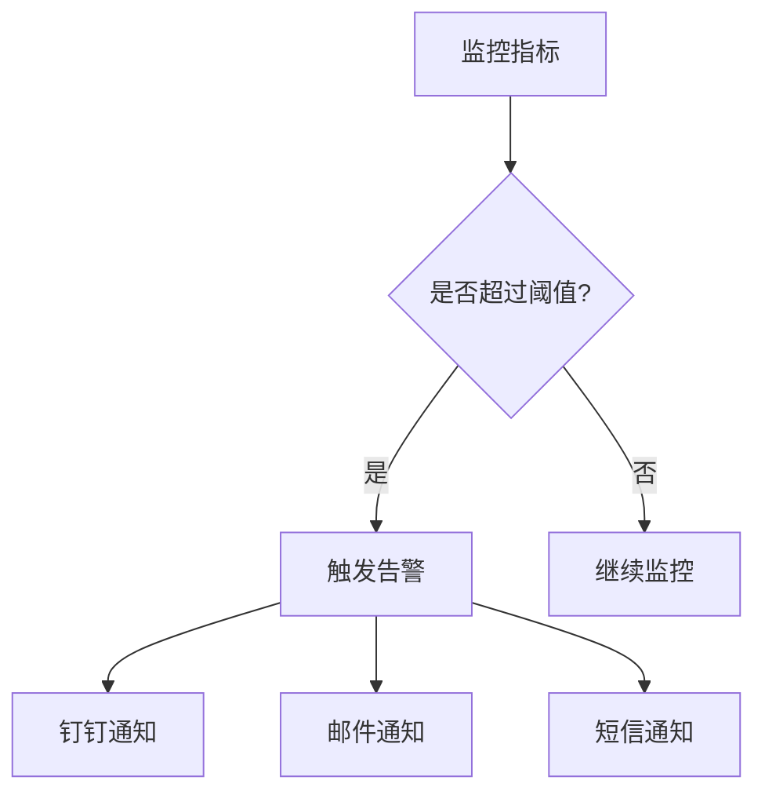
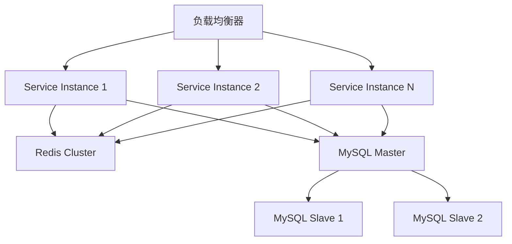

# 游戏好友系统技术设计文档

## 1. 系统架构

### 1.1 整体架构
系统采用微服务架构，使用 Golang 作为主要开发语言，整体架构如下：



### 1.2 核心组件
1. **Friend Service**: 好友关系管理核心服务
2. **Status Service**: 在线状态管理服务
3. **Recommendation Service**: 好友推荐服务
4. **Notification Service**: 消息推送服务
5. **Cache Layer**: 使用 Redis 集群作为缓存层
6. **Message Queue**: 使用 Kafka 作为消息队列

## 2. 数据模型设计

### 2.1 数据库表结构

```sql
-- 用户基础信息表
CREATE TABLE users (
    user_id BIGINT PRIMARY KEY,
    username VARCHAR(50) NOT NULL,
    status_code TINYINT DEFAULT 1,  -- 1:在线 2:离开 3:繁忙 4:隐身
    last_active TIMESTAMP,
    created_at TIMESTAMP DEFAULT CURRENT_TIMESTAMP,
    INDEX idx_username (username),
    INDEX idx_status (status_code)
);

-- 好友关系表
CREATE TABLE friendships (
    id BIGINT PRIMARY KEY,
    user_id BIGINT NOT NULL,
    friend_id BIGINT NOT NULL,
    group_id BIGINT,
    created_at TIMESTAMP DEFAULT CURRENT_TIMESTAMP,
    UNIQUE KEY unique_friendship (user_id, friend_id),
    INDEX idx_user_id (user_id),
    INDEX idx_friend_id (friend_id)
);

-- 好友分组表
CREATE TABLE friend_groups (
    group_id BIGINT PRIMARY KEY,
    user_id BIGINT NOT NULL,
    group_name VARCHAR(50) NOT NULL,
    created_at TIMESTAMP DEFAULT CURRENT_TIMESTAMP,
    INDEX idx_user_id (user_id)
);

-- 好友请求表
CREATE TABLE friend_requests (
    request_id BIGINT PRIMARY KEY,
    sender_id BIGINT NOT NULL,
    receiver_id BIGINT NOT NULL,
    status TINYINT DEFAULT 0,  -- 0:待处理 1:已接受 2:已拒绝
    created_at TIMESTAMP DEFAULT CURRENT_TIMESTAMP,
    INDEX idx_sender (sender_id),
    INDEX idx_receiver (receiver_id),
    INDEX idx_status (status)
);

-- 用户状态表
CREATE TABLE user_status (
    user_id BIGINT PRIMARY KEY,
    current_game VARCHAR(100),
    custom_status VARCHAR(200),
    last_updated TIMESTAMP,
    INDEX idx_last_updated (last_updated)
);
```

### 2.2 数据结构定义 (Golang)

```go
// 用户信息
type User struct {
    UserID    int64     `json:"user_id"`
    Username  string    `json:"username"`
    Status    int8      `json:"status"`
    LastActive time.Time `json:"last_active"`
    CreatedAt time.Time `json:"created_at"`
}

// 好友关系
type Friendship struct {
    ID        int64     `json:"id"`
    UserID    int64     `json:"user_id"`
    FriendID  int64     `json:"friend_id"`
    GroupID   int64     `json:"group_id"`
    CreatedAt time.Time `json:"created_at"`
}

// 好友请求
type FriendRequest struct {
    RequestID  int64     `json:"request_id"`
    SenderID   int64     `json:"sender_id"`
    ReceiverID int64     `json:"receiver_id"`
    Status     int8      `json:"status"`
    CreatedAt  time.Time `json:"created_at"`
}
```

### 2.3 缓存设计
使用 Redis 作为缓存系统：



## 3. 核心功能实现

### 3.1 好友添加流程



### 3.2 好友状态更新实现

```go
// StatusService 状态服务
type StatusService struct {
    redis  *redis.Client
    kafka  *kafka.Producer
    logger *zap.Logger
}

// UpdateStatus 更新用户状态
func (s *StatusService) UpdateStatus(ctx context.Context, userID int64, status *UserStatus) error {
    // 1. 更新 Redis 缓存
    key := fmt.Sprintf("user:status:%d", userID)
    if err := s.redis.HMSet(ctx, key, map[string]interface{}{
        "status_code":   status.StatusCode,
        "current_game":  status.CurrentGame,
        "custom_status": status.CustomStatus,
        "last_updated": time.Now().Unix(),
    }).Err(); err != nil {
        return fmt.Errorf("failed to update redis: %w", err)
    }

    // 2. 发送状态更新事件到 Kafka
    event := &StatusUpdateEvent{
        UserID:    userID,
        Status:    status,
        Timestamp: time.Now(),
    }
    
    if err := s.kafka.Produce(ctx, "status-updates", event); err != nil {
        s.logger.Error("failed to produce kafka message", zap.Error(err))
        // 不阻塞返回，仅记录日志
    }

    return nil
}
```

### 3.3 好友推荐系统



推荐系统实现示例：

```go
// RecommendationService 推荐服务
type RecommendationService struct {
    redis      *redis.Client
    db         *gorm.DB
    logger     *zap.Logger
}

// GetRecommendations 获取好友推荐
func (s *RecommendationService) GetRecommendations(ctx context.Context, userID int64) ([]*RecommendedFriend, error) {
    // 1. 尝试从缓存获取
    cacheKey := fmt.Sprintf("friend:recommendations:%d", userID)
    if cached, err := s.redis.Get(ctx, cacheKey).Result(); err == nil {
        var recommendations []*RecommendedFriend
        if err := json.Unmarshal([]byte(cached), &recommendations); err == nil {
            return recommendations, nil
        }
    }

    // 2. 计算推荐
    recommendations, err := s.computeRecommendations(ctx, userID)
    if err != nil {
        return nil, err
    }

    // 3. 更新缓存
    if data, err := json.Marshal(recommendations); err == nil {
        s.redis.Set(ctx, cacheKey, data, time.Hour)
    }

    return recommendations, nil
}
```

## 4. 性能优化策略

### 4.1 缓存策略



### 4.2 数据库优化
1. **分库分表策略**：
   - 按用户ID范围水平分片
   - 使用一致性哈希算法
   - 预留分片扩展空间

2. **索引优化**：
   - 为高频查询字段建立索引
   - 避免过度索引
   - 定期维护索引统计信息

### 4.3 并发处理

```go
// 使用分布式锁处理并发
func (s *FriendService) AddFriend(ctx context.Context, userID, friendID int64) error {
    // 获取分布式锁
    lockKey := fmt.Sprintf("lock:friend:add:%d:%d", userID, friendID)
    lock := s.redisLock.NewLock(lockKey, time.Second*30)
    
    if err := lock.Lock(); err != nil {
        return fmt.Errorf("failed to acquire lock: %w", err)
    }
    defer lock.Unlock()

    // 处理好友添加逻辑
    return s.processFriendAdd(ctx, userID, friendID)
}
```

## 5. 监控告警

### 5.1 监控指标
1. **系统性能指标**
   - QPS
   - 响应时间
   - 错误率
   - Goroutine 数量

2. **业务指标**
   - 好友添加成功率
   - 推荐准确率
   - 消息投递成功率

### 5.2 告警策略



## 6. 部署架构



## 7. 扩展性设计

1. **服务无状态化**
   - 所有服务实例无状态
   - 支持水平扩展
   - 使用服务发现

2. **接口版本控制**
   - URL 版本号
   - 向下兼容
   - 平滑升级策略

3. **跨区域部署**
   - 多区域数据同步
   - 就近访问策略
   - 容灾备份方案

## 8. 开发规范

1. **代码规范**
   - 遵循 Golang 官方规范
   - 统一错误处理
   - 完善的注释文档

2. **API 规范**
   - RESTful API 设计
   - 统一响应格式
   - 请求参数验证

3. **日志规范**
   - 统一日志格式
   - 分级日志
   - 链路追踪
