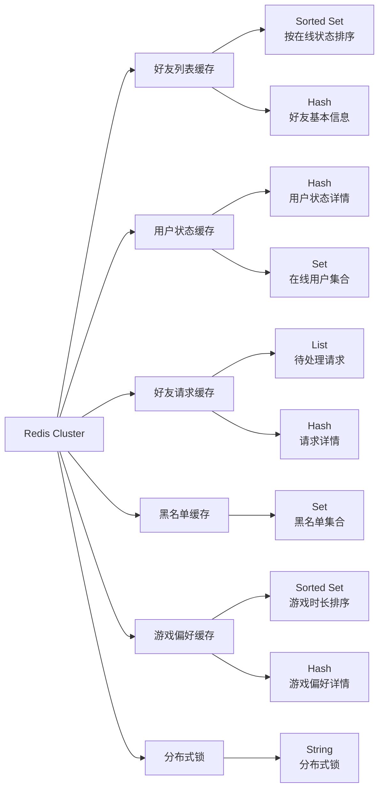
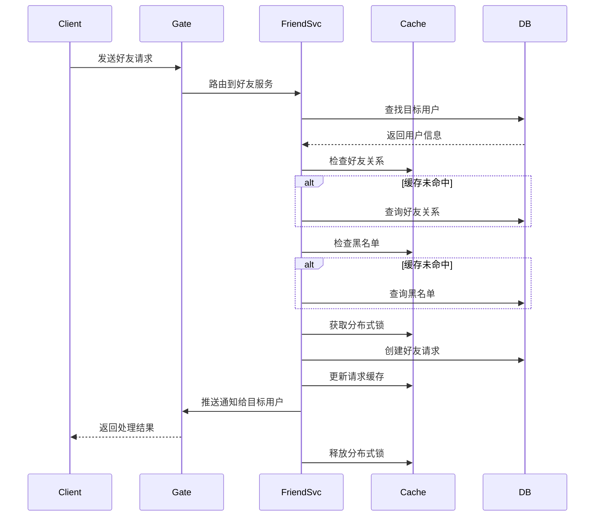
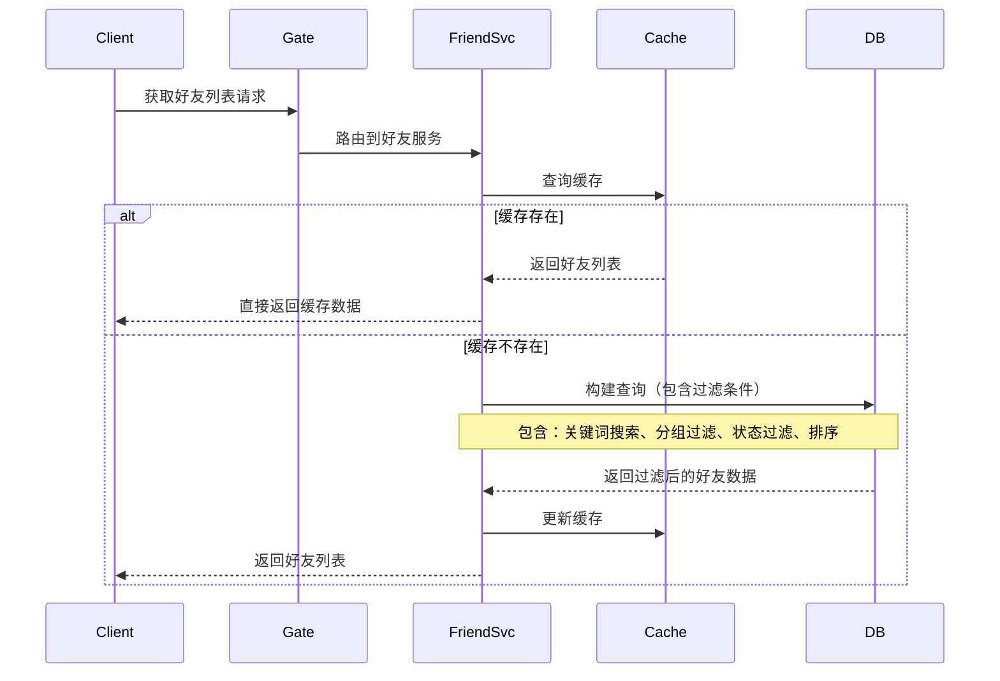
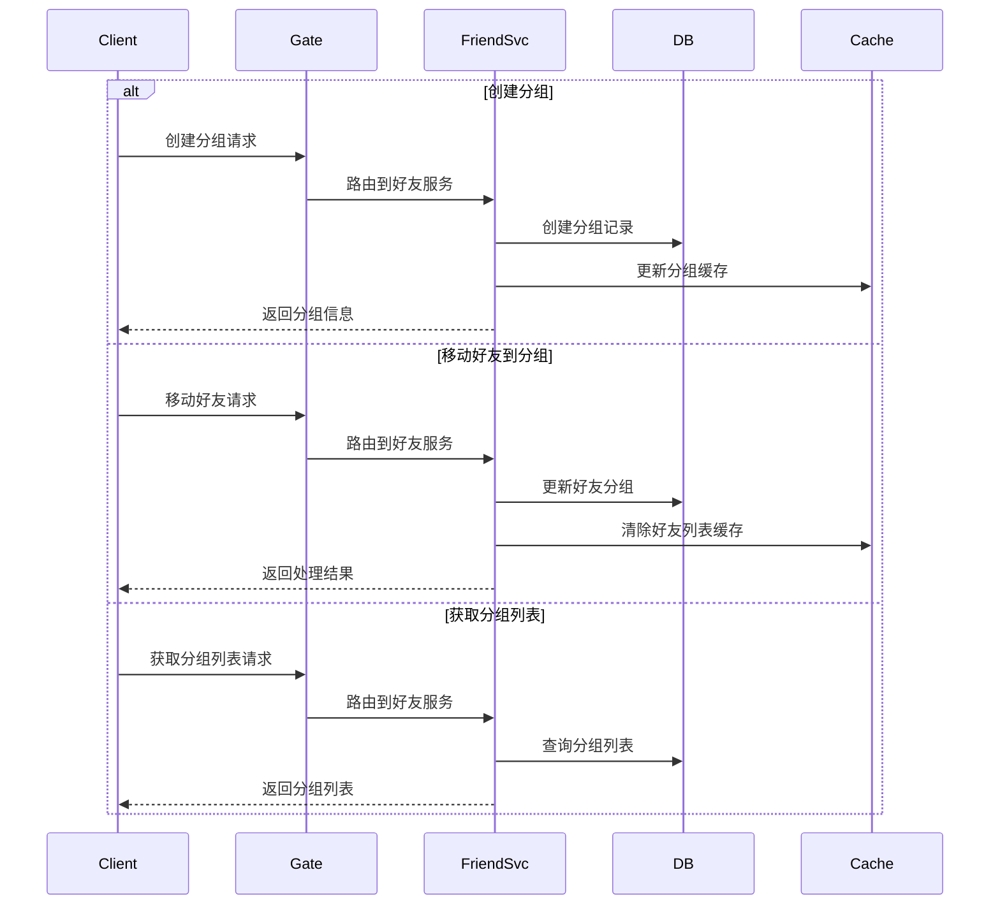
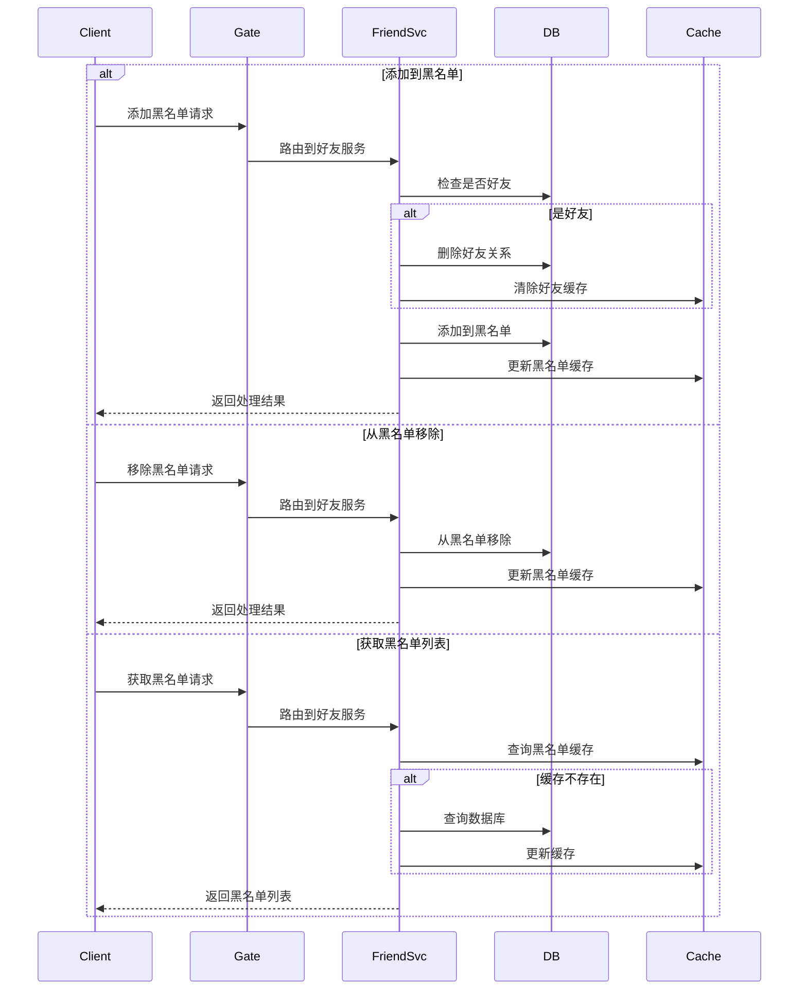
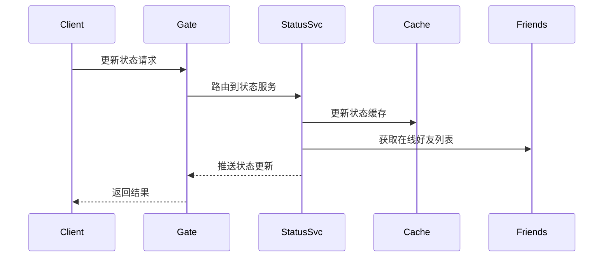
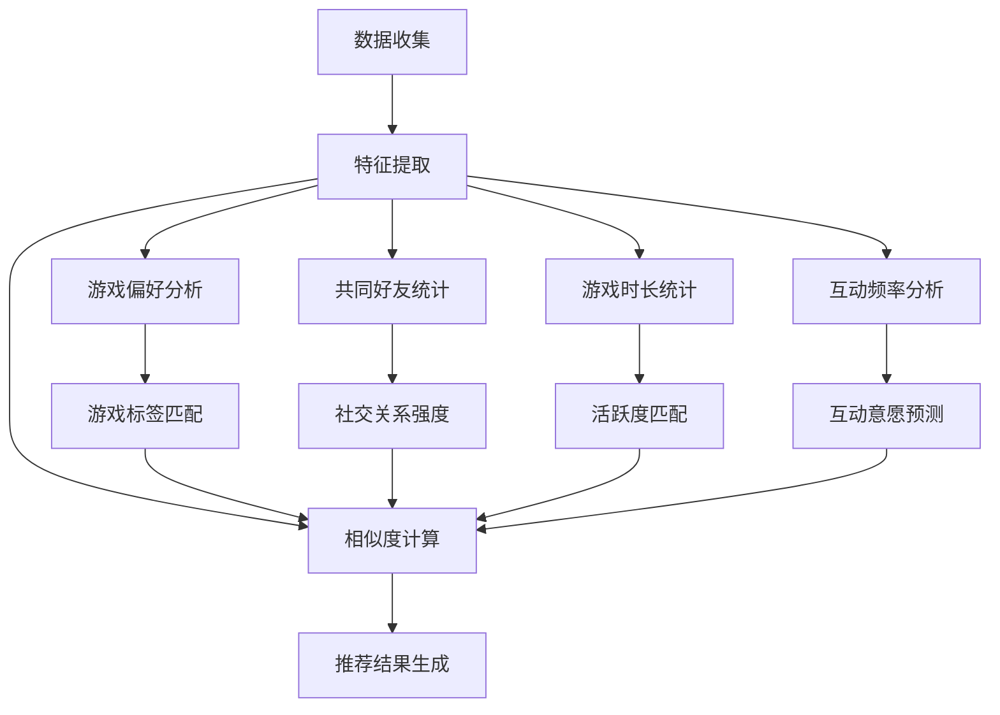

# 游戏好友系统技术设计文档

## 目录

- [1. 通信协议定义 (Protobuf)](#1-通信协议定义-protobuf)
  - [1.1 协议概览](#11-协议概览)
  - [1.2 基础消息定义](#12-基础消息定义)
  - [1.3 好友管理模块](#13-好友管理模块)
  - [1.4 状态管理模块](#14-状态管理模块)
  - [1.5 推荐系统模块](#15-推荐系统模块)
  - [1.6 消息ID定义](#16-消息id定义)
- [2. 数据模型设计](#2-数据模型设计)
  - [2.1 数据库表结构](#21-数据库表结构)
  - [2.2 数据结构定义](#22-数据结构定义-golang)
  - [2.3 缓存设计](#23-缓存设计)
- [3. 功能实现](#3-功能实现)
  - [3.1 好友管理功能](#31-好友管理功能)
  - [3.2 好友状态显示](#32-好友状态显示)
  - [3.3 好友推荐](#33-好友推荐)

## 1. 通信协议定义 (Protobuf)

#### 1.1 协议概览
- **好友管理模块**
  - 好友请求 (1001-1007)
  - 好友分组 (1101-1104)
  - 黑名单管理 (1201-1206)
- **状态管理模块**
  - 状态更新 (2001-2005)
- **推荐系统模块**
  - 好友推荐 (3001-3002)

#### 1.2 基础消息定义
```protobuf
syntax = "proto3";
package friend;

// 好友请求消息
message FriendRequestProto {
    int64 request_id = 1;
    int64 sender_id = 2;
    int64 receiver_id = 3;
    int32 status = 4;      // 0:待处理 1:已接受 2:已拒绝
    int64 created_at = 5;
}

// 好友信息
message FriendInfoProto {
    int64 user_id = 1;
    string username = 2;
    int32 status = 3;      // 1:在线 2:离开 3:繁忙 4:隐身
    string current_game = 4;
    string custom_status = 5;
}

// 好友列表请求
message GetFriendListReq {
    int64 user_id = 1;
    int32 page_size = 2;
    int32 page_num = 3;
}

// 好友列表响应
message GetFriendListResp {
    repeated FriendInfoProto friends = 1;
    int32 total_count = 2;
}

// 添加好友请求
message AddFriendReq {
    int64 user_id = 1;
    int64 friend_id = 2;
    string message = 3;
}

// 添加好友响应
message AddFriendResp {
    bool success = 1;
    string message = 2;
    FriendRequestProto request = 3;
}

// 好友状态变更通知
message FriendStatusNotify {
    int64 user_id = 1;
    int32 status = 2;
    string current_game = 3;
    string custom_status = 4;
    int64 updated_at = 5;
}

// 好友分组信息
message FriendGroupProto {
    int64 group_id = 1;
    int64 user_id = 2;
    string group_name = 3;
    int64 created_at = 4;
}

// 创建分组请求
message CreateGroupReq {
    int64 user_id = 1;
    string group_name = 2;
}

// 创建分组响应
message CreateGroupResp {
    bool success = 1;
    string message = 2;
    FriendGroupProto group = 3;
}

// 移动好友到分组请求
message MoveFriendToGroupReq {
    int64 user_id = 1;
    int64 friend_id = 2;
    int64 group_id = 3;
}

// 移动好友到分组响应
message MoveFriendToGroupResp {
    bool success = 1;
    string message = 2;
}

// 状态更新相关
message UpdateStatusReq {
    int64 user_id = 1;
    int32 status = 2;
    string custom_status = 3;
}

message UpdateStatusResp {
    bool success = 1;
    string message = 2;
}

// 服务定义
service FriendService {
    // 好友管理接口
    rpc GetFriendList(GetFriendListReq) returns (GetFriendListResp);
    rpc AddFriend(AddFriendReq) returns (AddFriendResp);
    
    // 状态管理接口
    rpc UpdateStatus(FriendStatusNotify) returns (google.protobuf.Empty);
    
    // 分组管理接口
    rpc CreateGroup(CreateGroupReq) returns (CreateGroupResp);
    rpc MoveFriendToGroup(MoveFriendToGroupReq) returns (MoveFriendToGroupResp);
}
```

#### 1.3 好友管理模块
```protobuf
// 好友请求相关
message FriendRequestProto {
    int64 request_id = 1;
    int64 sender_id = 2;
    int64 receiver_id = 3;
    int32 status = 4;      // 0:待处理 1:已接受 2:已拒绝
    int64 created_at = 5;
}

message AddFriendReq {
    int64 user_id = 1;
    int64 friend_id = 2;
    string message = 3;
}

message AddFriendResp {
    bool success = 1;
    string message = 2;
    FriendRequestProto request = 3;
}

// 好友分组相关
message FriendGroupProto {
    int64 group_id = 1;
    int64 user_id = 2;
    string group_name = 3;
    int64 created_at = 4;
}

message CreateGroupReq {
    int64 user_id = 1;
    string group_name = 2;
}

message CreateGroupResp {
    bool success = 1;
    string message = 2;
    FriendGroupProto group = 3;
}

message MoveFriendToGroupReq {
    int64 user_id = 1;
    int64 friend_id = 2;
    int64 group_id = 3;
}

message MoveFriendToGroupResp {
    bool success = 1;
    string message = 2;
}
```

#### 1.4 状态管理模块
```protobuf
// 状态更新相关
message FriendStatusNotify {
    int64 user_id = 1;
    int32 status = 2;
    string current_game = 3;
    string custom_status = 4;
    int64 updated_at = 5;
}

message UpdateStatusReq {
    int64 user_id = 1;
    int32 status = 2;
    string custom_status = 3;
}

message UpdateStatusResp {
    bool success = 1;
    string message = 2;
}
```

#### 1.5 推荐系统模块
```protobuf
// 推荐相关消息ID
message GetRecommendationsReq {
    int64 user_id = 1;
}

message GetRecommendationsResp {
    repeated FriendRecommendation recommendations = 1;
}
```

#### 1.6 消息ID定义
```go
const (
    // 好友管理相关消息ID (1001-1007)
    MSG_ID_ADD_FRIEND_REQ         = 1001
    MSG_ID_ADD_FRIEND_RESP        = 1002
    MSG_ID_DEL_FRIEND_REQ         = 1003
    MSG_ID_DEL_FRIEND_RESP        = 1004
    MSG_ID_GET_FRIEND_LIST_REQ    = 1005
    MSG_ID_GET_FRIEND_LIST_RESP   = 1006
    MSG_ID_FRIEND_REQUEST_NOTIFY  = 1007
    
    // 好友分组相关消息ID (1101-1104)
    MSG_ID_CREATE_GROUP_REQ       = 1101
    MSG_ID_CREATE_GROUP_RESP      = 1102
    MSG_ID_MOVE_TO_GROUP_REQ      = 1103
    MSG_ID_MOVE_TO_GROUP_RESP     = 1104
    
    // 黑名单相关消息ID (1201-1206)
    MSG_ID_ADD_BLACKLIST_REQ      = 1201
    MSG_ID_ADD_BLACKLIST_RESP     = 1202
    MSG_ID_DEL_BLACKLIST_REQ      = 1203
    MSG_ID_DEL_BLACKLIST_RESP     = 1204
    MSG_ID_GET_BLACKLIST_REQ      = 1205
    MSG_ID_GET_BLACKLIST_RESP     = 1206
    
    // 状态相关消息ID (2001-2005)
    MSG_ID_UPDATE_STATUS_REQ      = 2001
    MSG_ID_UPDATE_STATUS_RESP     = 2002
    MSG_ID_FRIEND_STATUS_NOTIFY   = 2003
    MSG_ID_GET_FRIEND_STATUS_REQ  = 2004
    MSG_ID_GET_FRIEND_STATUS_RESP = 2005
    
    // 推荐相关消息ID (3001-3002)
    MSG_ID_GET_RECOMMENDATIONS_REQ  = 3001
    MSG_ID_GET_RECOMMENDATIONS_RESP = 3002
)
```

## 2. 数据模型设计

### 2.1 数据库表结构

```sql
-- 用户基础信息表
CREATE TABLE users (
    user_id BIGINT PRIMARY KEY,
    username VARCHAR(50) NOT NULL,
    status_code TINYINT DEFAULT 1,  -- 1:在线 2:离开 3:繁忙 4:隐身
    last_active TIMESTAMP,
    created_at TIMESTAMP DEFAULT CURRENT_TIMESTAMP,
    INDEX idx_username (username),
    INDEX idx_status (status_code)
);

-- 好友关系表
CREATE TABLE friendships (
    id BIGINT PRIMARY KEY,
    user_id BIGINT NOT NULL,
    friend_id BIGINT NOT NULL,
    group_id BIGINT,
    created_at TIMESTAMP DEFAULT CURRENT_TIMESTAMP,
    UNIQUE KEY unique_friendship (user_id, friend_id),
    INDEX idx_user_id (user_id),
    INDEX idx_friend_id (friend_id)
);

-- 好友分组表
CREATE TABLE friend_groups (
    group_id BIGINT PRIMARY KEY,
    user_id BIGINT NOT NULL,
    group_name VARCHAR(50) NOT NULL,
    created_at TIMESTAMP DEFAULT CURRENT_TIMESTAMP,
    INDEX idx_user_id (user_id)
);

-- 好友请求表
CREATE TABLE friend_requests (
    request_id BIGINT PRIMARY KEY,
    sender_id BIGINT NOT NULL,
    receiver_id BIGINT NOT NULL,
    status TINYINT DEFAULT 0,  -- 0:待处理 1:已接受 2:已拒绝
    created_at TIMESTAMP DEFAULT CURRENT_TIMESTAMP,
    INDEX idx_sender (sender_id),
    INDEX idx_receiver (receiver_id),
    INDEX idx_status (status)
);

-- 用户状态表
CREATE TABLE user_status (
    user_id BIGINT PRIMARY KEY,
    current_game VARCHAR(100),
    custom_status VARCHAR(200),
    last_updated TIMESTAMP,
    INDEX idx_last_updated (last_updated)
);

-- 游戏偏好表（用于好友推荐）
CREATE TABLE user_game_preferences (
    id BIGINT PRIMARY KEY,
    user_id BIGINT NOT NULL,
    game_id BIGINT NOT NULL,
    play_time INT NOT NULL,  -- 游戏时长（分钟）
    last_played TIMESTAMP,   -- 最后一次游戏时间
    created_at TIMESTAMP DEFAULT CURRENT_TIMESTAMP,
    INDEX idx_user_game (user_id, game_id),
    INDEX idx_last_played (last_played)
);

-- 用户互动记录表（用于好友推荐）
CREATE TABLE user_interactions (
    id BIGINT PRIMARY KEY,
    user_id BIGINT NOT NULL,
    target_id BIGINT NOT NULL,
    interaction_type TINYINT NOT NULL, -- 1:聊天 2:组队 3:交易等
    created_at TIMESTAMP DEFAULT CURRENT_TIMESTAMP,
    INDEX idx_user_target (user_id, target_id),
    INDEX idx_created_at (created_at)
);

-- 黑名单表
CREATE TABLE blacklist (
    id BIGINT PRIMARY KEY,
    user_id BIGINT NOT NULL,
    target_id BIGINT NOT NULL,
    created_at TIMESTAMP DEFAULT CURRENT_TIMESTAMP,
    UNIQUE KEY unique_blacklist (user_id, target_id),
    INDEX idx_user_id (user_id),
    INDEX idx_target_id (target_id)
);
```

### 2.2 数据结构定义 (Golang)

```go
// 状态码常量
const (
    STATUS_OFFLINE = iota
    STATUS_ONLINE
    STATUS_AWAY
    STATUS_BUSY
    STATUS_INVISIBLE
)

// 互动类型常量
const (
    INTERACTION_CHAT = iota + 1
    INTERACTION_TEAM
    INTERACTION_TRADE
    INTERACTION_GIFT
    INTERACTION_PVP
)

// 好友请求状态常量
const (
    FRIEND_REQUEST_PENDING = iota
    FRIEND_REQUEST_ACCEPTED
    FRIEND_REQUEST_REJECTED
)

// 用户信息
type User struct {
    UserID    int64     `json:"user_id"`
    Username  string    `json:"username"`
    Status    int8      `json:"status"`
    LastActive time.Time `json:"last_active"`
    CreatedAt time.Time `json:"created_at"`
}

// 好友关系
type Friendship struct {
    ID        int64     `json:"id"`
    UserID    int64     `json:"user_id"`
    FriendID  int64     `json:"friend_id"`
    GroupID   int64     `json:"group_id"`
    CreatedAt time.Time `json:"created_at"`
}

// 好友请求
type FriendRequest struct {
    RequestID  int64     `json:"request_id"`
    SenderID   int64     `json:"sender_id"`
    ReceiverID int64     `json:"receiver_id"`
    Status     int8      `json:"status"`
    CreatedAt  time.Time `json:"created_at"`
}

// 游戏偏好信息
type GamePreference struct {
    ID         int64     `json:"id"`
    UserID     int64     `json:"user_id"`
    GameID     int64     `json:"game_id"`
    PlayTime   int       `json:"play_time"`
    LastPlayed time.Time `json:"last_played"`
    CreatedAt  time.Time `json:"created_at"`
}

// 用户互动记录
type UserInteraction struct {
    ID             int64     `json:"id"`
    UserID         int64     `json:"user_id"`
    TargetID       int64     `json:"target_id"`
    InteractionType int8      `json:"interaction_type"`
    CreatedAt      time.Time `json:"created_at"`
}

// 黑名单记录
type Blacklist struct {
    ID        int64     `json:"id"`
    UserID    int64     `json:"user_id"`
    TargetID  int64     `json:"target_id"`
    CreatedAt time.Time `json:"created_at"`
}

// 用户状态
type UserStatus struct {
    UserID       int64     `json:"user_id"`
    Status       int8      `json:"status"`
    CurrentGame  string    `json:"current_game"`
    CustomStatus string    `json:"custom_status"`
    UpdatedAt    int64     `json:"updated_at"`
}

// 好友分组
type FriendGroup struct {
    GroupID    int64     `json:"group_id"`
    UserID     int64     `json:"user_id"`
    GroupName  string    `json:"group_name"`
    CreatedAt  time.Time `json:"created_at"`
}

// 游戏信息
type GameInfo struct {
    GameID      int64     `json:"game_id"`
    GameName    string    `json:"game_name"`
    GameTags    []string  `json:"game_tags"`
    CreatedAt   time.Time `json:"created_at"`
}

// 用户特征
type UserFeatures struct {
    UserID          int64             `json:"user_id"`
    GamePreferences []*GamePreference `json:"game_preferences"`
    ActiveTimeSlots []int32          `json:"active_time_slots"` // 24小时制的活跃时间段
    InteractionStats map[string]int   `json:"interaction_stats"` // 各类互动的统计
}

// 搜索选项
type FriendSearchOptions struct {
    Keyword    string    `json:"keyword"`     // 搜索关键词
    GroupID    int64     `json:"group_id"`    // 分组ID
    Status     int8      `json:"status"`      // 在线状态过滤
    SortBy     string    `json:"sort_by"`     // 排序字段
    SortOrder  string    `json:"sort_order"`  // 排序顺序
    PageSize   int32     `json:"page_size"`   // 分页大小
    PageNum    int32     `json:"page_num"`    // 页码
}

// 用户基本信息
type UserInfo struct {
    UserID       int64     `json:"user_id"`
    Username     string    `json:"username"`
    Status       int8      `json:"status"`
    CurrentGame  string    `json:"current_game"`
    CustomStatus string    `json:"custom_status"`
    LastActive   time.Time `json:"last_active"`
}
```

### 2.3 缓存设计
使用 Redis 作为缓存系统：



#### 2.3.1 缓存键设计
```go
const (
    // 好友列表相关
    CACHE_KEY_FRIEND_LIST     = "friend:list:%d"        // ZSET，好友列表，score为在线状态
    CACHE_KEY_FRIEND_INFO     = "friend:info:%d"        // HASH，好友信息
    CACHE_KEY_FRIEND_GROUPS   = "friend:groups:%d"      // SET，好友分组列表
    
    // 用户状态相关
    CACHE_KEY_USER_STATUS     = "user:status:%d"        // HASH，用户状态详情
    CACHE_KEY_ONLINE_USERS    = "user:online"           // SET，在线用户集合
    
    // 好友请求相关
    CACHE_KEY_PENDING_REQUESTS = "friend:requests:%d"    // LIST，待处理的好友请求
    CACHE_KEY_REQUEST_INFO    = "friend:request:%d"      // HASH，请求详情
    
    // 黑名单相关
    CACHE_KEY_BLACKLIST       = "blacklist:%d"          // SET，用户的黑名单集合
    
    // 游戏偏好相关
    CACHE_KEY_GAME_PREF      = "game:pref:%d"          // ZSET，用户游戏偏好，score为游戏时长
    CACHE_KEY_GAME_INFO      = "game:info:%d"          // HASH，游戏详情
    
    // 分布式锁相关
    CACHE_KEY_LOCK_FRIEND    = "lock:friend:%d:%d"     // STRING，好友操作锁
    CACHE_KEY_LOCK_STATUS    = "lock:status:%d"        // STRING，状态更新锁
    
    // 缓存过期时间
    CACHE_EXPIRE_FRIEND_LIST = time.Minute * 5
    CACHE_EXPIRE_USER_STATUS = time.Minute * 1
    CACHE_EXPIRE_LOCK        = time.Second * 30
)
```

#### 2.3.2 缓存更新策略
1. **好友列表缓存**
   - 写入：好友关系变更时更新
   - 过期：5分钟
   - 更新机制：延迟双删

2. **用户状态缓存**
   - 写入：状态变更时实时更新
   - 过期：1分钟
   - 更新机制：先更新数据库，再删除缓存

3. **好友请求缓存**
   - 写入：发送请求时写入
   - 过期：无过期时间
   - 更新机制：请求状态变更时更新

4. **黑名单缓存**
   - 写入：添加黑名单时写入
   - 过期：无过期时间
   - 更新机制：增删改时同步更新

5. **游戏偏好缓存**
   - 写入：游戏结束时更新
   - 过期：1天
   - 更新机制：增量更新

6. **分布式锁**
   - 写入：操作开始时获取
   - 过期：30秒
   - 更新机制：操作完成后释放

## 3. 功能实现

### 3.1 好友管理功能

#### 3.1.1 消息ID定义
```go
const (
    // 好友管理相关消息ID
    MSG_ID_ADD_FRIEND_REQ         = 1001
    MSG_ID_ADD_FRIEND_RESP        = 1002
    MSG_ID_DEL_FRIEND_REQ         = 1003
    MSG_ID_DEL_FRIEND_RESP        = 1004
    MSG_ID_GET_FRIEND_LIST_REQ    = 1005
    MSG_ID_GET_FRIEND_LIST_RESP   = 1006
    MSG_ID_FRIEND_REQUEST_NOTIFY  = 1007
    
    // 好友分组相关消息ID
    MSG_ID_CREATE_GROUP_REQ       = 1101
    MSG_ID_CREATE_GROUP_RESP      = 1102
    MSG_ID_MOVE_TO_GROUP_REQ      = 1103
    MSG_ID_MOVE_TO_GROUP_RESP     = 1104
    
    // 黑名单相关消息ID
    MSG_ID_ADD_BLACKLIST_REQ      = 1201
    MSG_ID_ADD_BLACKLIST_RESP     = 1202
    MSG_ID_DEL_BLACKLIST_REQ      = 1203
    MSG_ID_DEL_BLACKLIST_RESP     = 1204
    MSG_ID_GET_BLACKLIST_REQ      = 1205
    MSG_ID_GET_BLACKLIST_RESP     = 1206
)
```

#### 3.1.2 好友添加流程



```go
// AddFriend 通过用户名或ID添加好友
func (s *FriendService) AddFriend(ctx context.Context, userID int64, target string) error {
    // 1. 判断是通过用户名还是ID添加
    var targetUser User
    if id, err := strconv.ParseInt(target, 10, 64); err == nil {
        // 通过ID添加
        if err := s.db.First(&targetUser, id).Error; err != nil {
            return err
        }
    } else {
        // 通过用户名添加
        if err := s.db.Where("username = ?", target).First(&targetUser).Error; err != nil {
            return err
        }
    }
    
    // 2. 检查是否已经是好友
    if s.IsFriend(ctx, userID, targetUser.UserID) {
        return errors.New("already friends")
    }
    
    // 3. 检查是否在黑名单中
    if s.IsInBlacklist(ctx, targetUser.UserID, userID) {
        return errors.New("you are in target's blacklist")
    }
    
    // 4. 创建好友请求
    return s.CreateFriendRequest(ctx, userID, targetUser.UserID)
}

// DeleteFriend 删除好友关系
func (s *FriendService) DeleteFriend(ctx context.Context, userID, friendID int64) error {
    // 1. 获取分布式锁
    lockKey := fmt.Sprintf(CACHE_KEY_LOCK_FRIEND, userID, friendID)
    lock := s.redisLock.NewLock(lockKey, time.Second*30)
    if err := lock.Lock(); err != nil {
        return fmt.Errorf("failed to acquire lock: %w", err)
    }
    defer lock.Unlock()

    // 2. 开启事务删除双向好友关系
    tx := s.db.Begin()
    if err := tx.Where("(user_id = ? AND friend_id = ?) OR (user_id = ? AND friend_id = ?)",
        userID, friendID, friendID, userID).Delete(&Friendship{}).Error; err != nil {
        tx.Rollback()
        return fmt.Errorf("failed to delete friendship: %w", err)
    }
    if err := tx.Commit().Error; err != nil {
        return fmt.Errorf("failed to commit transaction: %w", err)
    }

    // 3. 使用Pipeline批量更新缓存
    pipe := s.redis.Pipeline()
    
    // 删除双方的好友缓存
    pipe.Del(ctx, fmt.Sprintf(CACHE_KEY_FRIEND_LIST, userID))
    pipe.Del(ctx, fmt.Sprintf(CACHE_KEY_FRIEND_LIST, friendID))
    
    // 从好友集合中移除
    pipe.SRem(ctx, fmt.Sprintf("friend:set:%d", userID), friendID)
    pipe.SRem(ctx, fmt.Sprintf("friend:set:%d", friendID), userID)
    
    // 执行Pipeline操作
    if _, err := pipe.Exec(ctx); err != nil {
        s.logger.Error("failed to update friend cache",
            zap.Error(err),
            zap.Int64("user_id", userID),
            zap.Int64("friend_id", friendID))
    }

    // 4. 发送好友关系变更通知
    go func() {
        // 通知用户A
        if session, ok := s.sessions.Load(userID); ok {
            session.(*Session).Send(MSG_ID_DEL_FRIEND_RESP, &struct {
                FriendID int64 `json:"friend_id"`
            }{FriendID: friendID})
        }
        // 通知用户B
        if session, ok := s.sessions.Load(friendID); ok {
            session.(*Session).Send(MSG_ID_DEL_FRIEND_RESP, &struct {
                FriendID int64 `json:"friend_id"`
            }{FriendID: userID})
        }
    }()

    return nil
}

// IsFriend 检查两个用户是否已经是好友
func (s *FriendService) IsFriend(ctx context.Context, userID, friendID int64) bool {
    // 1. 先查缓存
    cacheKey := fmt.Sprintf(CACHE_KEY_FRIEND_LIST, userID)
    if exists, err := s.redis.SIsMember(ctx, cacheKey, friendID).Result(); err == nil && exists {
        return true
    }
    
    // 2. 查数据库
    var count int64
    s.db.Model(&Friendship{}).
        Where("(user_id = ? AND friend_id = ?) OR (user_id = ? AND friend_id = ?)",
            user_id, friend_id, friend_id, user_id).
        Count(&count)
    
    return count > 0
}

// IsInBlacklist 检查用户是否在黑名单中
func (s *FriendService) IsInBlacklist(ctx context.Context, userID, targetID int64) bool {
    // 1. 先查缓存
    cacheKey := fmt.Sprintf(CACHE_KEY_BLACKLIST, userID)
    if exists, err := s.redis.SIsMember(ctx, cacheKey, targetID).Result(); err == nil && exists {
        return true
    }
    
    // 2. 查数据库
    var count int64
    s.db.Model(&Blacklist{}).
        Where("user_id = ? AND target_id = ?", user_id, target_id).
        Count(&count)
    
    return count > 0
}

// CreateFriendRequest 创建好友请求
func (s *FriendService) CreateFriendRequest(ctx context.Context, userID, targetID int64) error {
    // 1. 获取分布式锁
    lockKey := fmt.Sprintf(CACHE_KEY_LOCK_FRIEND, userID, targetID)
    lock := s.redisLock.NewLock(lockKey, time.Second*30)
    if err := lock.Lock(); err != nil {
        return fmt.Errorf("failed to acquire lock: %w", err)
    }
    defer lock.Unlock()
    
    // 2. 创建好友请求
    request := &FriendRequest{
        RequestID:  generateID(),
        SenderID:   userID,
        ReceiverID: targetID,
        Status:     FRIEND_REQUEST_PENDING,
        CreatedAt:  time.Now(),
    }
    
    if err := s.db.Create(request).Error; err != nil {
        return err
    }
    
    // 3. 更新缓存
    cacheKey := fmt.Sprintf(CACHE_KEY_PENDING_REQUESTS, targetID)
    s.redis.RPush(ctx, cacheKey, request.RequestID)
    
    // 4. 发送通知
    if session, ok := s.sessions.Load(targetID); ok {
        session.(*Session).Send(MSG_ID_FRIEND_REQUEST_NOTIFY, &FriendRequestProto{
            RequestID:  request.RequestID,
            SenderID:   request.SenderID,
            ReceiverID: request.ReceiverID,
            Status:     request.Status,
            CreatedAt:  request.CreatedAt.Unix(),
        })
    }
    
    return nil
}
```

#### 3.1.3 好友列表获取流程



```go
// 获取好友列表（支持分组和搜索）
func (s *FriendService) GetFriendList(ctx context.Context, userID int64, opts *FriendSearchOptions) (*GetFriendListResp, error) {
    // 1. 尝试从缓存获取完整好友列表
    var friends []*FriendInfoProto
    cacheKey := fmt.Sprintf("friend:list:%d", userID)
    if data, err := s.redis.Get(ctx, cacheKey).Result(); err == nil {
        if err := json.Unmarshal([]byte(data), &friends); err == nil {
            // 对缓存数据应用过滤
            friends = applyFilters(friends, opts)
            return &GetFriendListResp{
                Friends: friends,
                TotalCount: int32(len(friends)),
            }, nil
        }
    }
    
    // 2. 缓存未命中，从数据库查询
    query := s.db.Table("friendships f").
        Joins("JOIN users u ON f.friend_id = u.user_id").
        Where("f.user_id = ?", userID)
    
    // 应用过滤条件
    if opts.Keyword != "" {
        query = query.Where("u.username LIKE ?", "%"+opts.Keyword+"%")
    }
    if opts.GroupID > 0 {
        query = query.Where("f.group_id = ?", opts.GroupID)
    }
    if opts.Status > 0 {
        query = query.Where("u.status_code = ?", opts.Status)
    }
    if opts.SortBy != "" {
        order := opts.SortBy
        if opts.SortOrder == "desc" {
            order += " DESC"
        }
        query = query.Order(order)
    }
    
    if err := query.Find(&friends).Error; err != nil {
        return nil, err
    }
    
    // 3. 更新缓存
    if data, err := json.Marshal(friends); err == nil {
        s.redis.Set(ctx, cacheKey, data, time.Minute*5)
    }
    
    // 对结果应用过滤
    friends = applyFilters(friends, opts)
    
    return &GetFriendListResp{
        Friends: friends,
        TotalCount: int32(len(friends)),
    }, nil
}
```

#### 3.1.4 好友分组管理流程



```go
// FriendGroupService 好友分组服务
type FriendGroupService struct {
    db     *gorm.DB
    redis  *redis.Client
    logger *zap.Logger
}

// CreateGroup 创建好友分组
func (s *FriendGroupService) CreateGroup(ctx context.Context, userID int64, groupName string) (*FriendGroup, error) {
    group := &FriendGroup{
        UserID:    userID,
        GroupName: groupName,
        CreatedAt: time.Now(),
    }
    
    if err := s.db.Create(group).Error; err != nil {
        return nil, err
    }
    
    // 更新缓存
    s.updateGroupCache(ctx, userID)
    return group, nil
}

// updateGroupCache 更新用户的好友分组缓存
func (s *FriendGroupService) updateGroupCache(ctx context.Context, userID int64) error {
    // 1. 从数据库获取最新的分组列表
    var groups []*FriendGroup
    if err := s.db.Where("user_id = ?", userID).Find(&groups).Error; err != nil {
        s.logger.Error("failed to get groups from db",
            zap.Error(err),
            zap.Int64("user_id", userID))
        return err
    }
    
    // 2. 序列化分组数据
    groupData, err := json.Marshal(groups)
    if err != nil {
        s.logger.Error("failed to marshal groups",
            zap.Error(err),
            zap.Int64("user_id", userID))
        return err
    }
    
    // 3. 使用Pipeline批量更新缓存
    pipe := s.redis.Pipeline()
    
    // 更新分组列表缓存
    cacheKey := fmt.Sprintf(CACHE_KEY_FRIEND_GROUPS, userID)
    pipe.Set(ctx, cacheKey, groupData, time.Hour*24)
    
    // 将分组ID添加到用户的分组集合中
    groupSetKey := fmt.Sprintf("user:groups:%d", userID)
    pipe.Del(ctx, groupSetKey)
    for _, group := range groups {
        pipe.SAdd(ctx, groupSetKey, group.GroupID)
    }
    
    // 执行Pipeline操作
    if _, err := pipe.Exec(ctx); err != nil {
        s.logger.Error("failed to update group cache",
            zap.Error(err),
            zap.Int64("user_id", userID))
        return err
    }
    
    return nil
}

// MoveFriendToGroup 移动好友到指定分组
func (s *FriendGroupService) MoveFriendToGroup(ctx context.Context, userID, friendID, groupID int64) error {
    if err := s.db.Model(&Friendship{}).
        Where("user_id = ? AND friend_id = ?", userID, friendID).
        Update("group_id", groupID).Error; err != nil {
        return err
    }
    
    // 更新缓存
    s.redis.Del(ctx, fmt.Sprintf("friend:list:%d", userID))
    return nil
}

// GetGroups 获取用户的好友分组列表
func (s *FriendGroupService) GetGroups(ctx context.Context, userID int64) ([]*FriendGroup, error) {
    var groups []*FriendGroup
    if err := s.db.Where("user_id = ?", userID).Find(&groups).Error; err != nil {
        return nil, err
    }
    return groups, nil
}
```

#### 3.1.5 黑名单管理流程



```go
// AddToBlacklist 添加用户到黑名单
func (s *FriendService) AddToBlacklist(ctx context.Context, userID, targetID int64) error {
    // 1. 获取分布式锁
    lockKey := fmt.Sprintf(CACHE_KEY_LOCK_FRIEND, userID, targetID)
    lock := s.redisLock.NewLock(lockKey, time.Second*30)
    if err := lock.Lock(); err != nil {
        return fmt.Errorf("failed to acquire lock: %w", err)
    }
    defer lock.Unlock()
    
    // 2. 检查是否已经是好友
    if s.IsFriend(ctx, userID, targetID) {
        // 删除好友关系
        if err := s.DeleteFriend(ctx, userID, targetID); err != nil {
            return err
        }
    }
    
    // 3. 添加到黑名单
    blacklist := &Blacklist{
        ID:        generateID(),
        UserID:    userID,
        TargetID:  targetID,
        CreatedAt: time.Now(),
    }
    
    if err := s.db.Create(blacklist).Error; err != nil {
        return err
    }
    
    // 4. 更新缓存
    cacheKey := fmt.Sprintf(CACHE_KEY_BLACKLIST, userID)
    s.redis.SAdd(ctx, cacheKey, targetID)
    
    return nil
}

// RemoveFromBlacklist 从黑名单移除用户
func (s *FriendService) RemoveFromBlacklist(ctx context.Context, userID, targetID int64) error {
    // 1. 获取分布式锁
    lockKey := fmt.Sprintf(CACHE_KEY_LOCK_FRIEND, userID, targetID)
    lock := s.redisLock.NewLock(lockKey, time.Second*30)
    if err := lock.Lock(); err != nil {
        return fmt.Errorf("failed to acquire lock: %w", err)
    }
    defer lock.Unlock()
    
    // 2. 从数据库删除
    if err := s.db.Where("user_id = ? AND target_id = ?", userID, targetID).
        Delete(&Blacklist{}).Error; err != nil {
        return err
    }
    
    // 3. 更新缓存
    cacheKey := fmt.Sprintf(CACHE_KEY_BLACKLIST, userID)
    s.redis.SRem(ctx, cacheKey, targetID)
    
    return nil
}

// GetBlacklist 获取用户的黑名单列表
func (s *FriendService) GetBlacklist(ctx context.Context, userID int64) ([]*UserInfo, error) {
    // 1. 先查缓存
    cacheKey := fmt.Sprintf(CACHE_KEY_BLACKLIST, userID)
    if data, err := s.redis.Get(ctx, cacheKey).Result(); err == nil {
        var users []*UserInfo
        if err := json.Unmarshal([]byte(data), &users); err == nil {
            return users, nil
        }
    }
    
    // 2. 查数据库
    var blacklist []*Blacklist
    if err := s.db.Where("user_id = ?", userID).Find(&blacklist).Error; err != nil {
        return nil, err
    }
    
    // 3. 获取用户信息
    targetIDs := make([]int64, len(blacklist))
    for i, b := range blacklist {
        targetIDs[i] = b.TargetID
    }
    
    var users []*UserInfo
    if err := s.db.Where("user_id IN ?", targetIDs).Find(&users).Error; err != nil {
        return nil, err
    }
    
    // 4. 更新缓存
    if data, err := json.Marshal(users); err == nil {
        s.redis.Set(ctx, cacheKey, data, time.Hour*24)
    }
    
    return users, nil
}

// 处理黑名单相关消息
func (s *FriendService) handleBlacklistMsg(ctx context.Context, session *Session, msgID uint32, data []byte) error {
    switch msgID {
    case MSG_ID_ADD_BLACKLIST_REQ:
        var req struct {
            UserID   int64 `json:"user_id"`
            TargetID int64 `json:"target_id"`
        }
        if err := json.Unmarshal(data, &req); err != nil {
            return err
        }
        return s.AddToBlacklist(ctx, req.UserID, req.TargetID)
        
    case MSG_ID_DEL_BLACKLIST_REQ:
        var req struct {
            UserID   int64 `json:"user_id"`
            TargetID int64 `json:"target_id"`
        }
        if err := json.Unmarshal(data, &req); err != nil {
            return err
        }
        return s.RemoveFromBlacklist(ctx, req.UserID, req.TargetID)
        
    case MSG_ID_GET_BLACKLIST_REQ:
        var req struct {
            UserID int64 `json:"user_id"`
        }
        if err := json.Unmarshal(data, &req); err != nil {
            return err
        }
        users, err := s.GetBlacklist(ctx, req.UserID)
        if err != nil {
            return err
        }
        return session.Send(MSG_ID_GET_BLACKLIST_RESP, users)
        
    default:
        return errors.New("unknown message id")
    }
}
```

### 3.2 好友状态显示

#### 3.2.1 消息ID定义
```go
const (
    // 状态相关消息ID
    MSG_ID_UPDATE_STATUS_REQ      = 2001
    MSG_ID_UPDATE_STATUS_RESP     = 2002
    MSG_ID_FRIEND_STATUS_NOTIFY   = 2003
    MSG_ID_GET_FRIEND_STATUS_REQ  = 2004
    MSG_ID_GET_FRIEND_STATUS_RESP = 2005
)
```

#### 3.2.2 状态管理流程



```go
// StatusManager 在线状态管理器
type StatusManager struct {
    sessions    sync.Map // userID -> *Session
    redis       *redis.Client
    logger      *zap.Logger
}

// OnUserOnline 处理用户上线
func (m *StatusManager) OnUserOnline(session *Session) {
    // 1. 保存会话信息
    m.sessions.Store(session.UserID, session)
    
    // 2. 更新用户状态
    status := &UserStatus{
        UserID:    session.UserID,
        Status:    STATUS_ONLINE,
        UpdatedAt: time.Now().Unix(),
    }
    
    if err := m.updateStatus(session.ctx, status); err != nil {
        m.logger.Error("failed to update status", zap.Error(err))
        return
    }
    
    // 3. 通知好友上线
    friends, _ := m.getFriendIDs(session.UserID)
    for _, friendID := range friends {
        if s, ok := m.sessions.Load(friendID); ok {
            s.(*Session).Send(MSG_ID_FRIEND_STATUS_NOTIFY, &FriendStatusNotify{
                UserID:    session.UserID,
                Status:    STATUS_ONLINE,
                UpdatedAt: status.UpdatedAt,
            })
        }
    }
}

// OnUserOffline 处理用户下线
func (m *StatusManager) OnUserOffline(session *Session) {
    // 1. 移除会话信息
    m.sessions.Delete(session.UserID)
    
    // 2. 更新用户状态
    status := &UserStatus{
        UserID:    session.UserID,
        Status:    STATUS_OFFLINE,
        UpdatedAt: time.Now().Unix(),
    }
    
    if err := m.updateStatus(session.ctx, status); err != nil {
        m.logger.Error("failed to update status", zap.Error(err))
        return
    }
    
    // 3. 通知好友下线
    friends, _ := m.getFriendIDs(session.UserID)
    for _, friendID := range friends {
        if s, ok := m.sessions.Load(friendID); ok {
            s.(*Session).Send(MSG_ID_FRIEND_STATUS_NOTIFY, &FriendStatusNotify{
                UserID:    session.UserID,
                Status:    STATUS_OFFLINE,
                UpdatedAt: status.UpdatedAt,
            })
        }
    }
}

// UpdateStatus 更新用户状态
func (m *StatusManager) UpdateStatus(ctx context.Context, userID int64, status int8, customStatus string) error {
    newStatus := &UserStatus{
        UserID:       userID,
        Status:       status,
        CustomStatus: customStatus,
        UpdatedAt:    time.Now().Unix(),
    }
    
    return m.updateStatus(ctx, newStatus)
}

// updateStatus 内部实现状态更新
func (m *StatusManager) updateStatus(ctx context.Context, status *UserStatus) error {
    // 1. 获取分布式锁
    lockKey := fmt.Sprintf(CACHE_KEY_LOCK_STATUS, status.UserID)
    lock := m.redisLock.NewLock(lockKey, time.Second*30)
    if err := lock.Lock(); err != nil {
        return fmt.Errorf("failed to acquire lock: %w", err)
    }
    defer lock.Unlock()

    // 2. 更新数据库
    if err := m.db.Model(&UserStatus{}).
        Where("user_id = ?", status.UserID).
        Updates(map[string]interface{}{
            "status":        status.Status,
            "custom_status": status.CustomStatus,
            "last_updated":  time.Now(),
        }).Error; err != nil {
        return fmt.Errorf("failed to update status in db: %w", err)
    }

    // 3. 更新Redis缓存
    cacheKey := fmt.Sprintf(CACHE_KEY_USER_STATUS, status.UserID)
    statusData, err := json.Marshal(status)
    if err != nil {
        return fmt.Errorf("failed to marshal status: %w", err)
    }

    // 使用Pipeline批量执行Redis操作
    pipe := m.redis.Pipeline()
    
    // 更新状态详情
    pipe.Set(ctx, cacheKey, statusData, CACHE_EXPIRE_USER_STATUS)
    
    // 更新在线用户集合
    if status.Status == STATUS_ONLINE {
        pipe.SAdd(ctx, CACHE_KEY_ONLINE_USERS, status.UserID)
    } else {
        pipe.SRem(ctx, CACHE_KEY_ONLINE_USERS, status.UserID)
    }
    
    if _, err := pipe.Exec(ctx); err != nil {
        return fmt.Errorf("failed to update redis cache: %w", err)
    }

    // 4. 获取好友列表并发送通知
    friends, err := m.getFriendIDs(status.UserID)
    if err != nil {
        m.logger.Error("failed to get friend ids", 
            zap.Error(err),
            zap.Int64("user_id", status.UserID))
        return nil // 不中断状态更新流程
    }

    // 5. 异步发送状态更新通知
    go func() {
        for _, friendID := range friends {
            if session, ok := m.sessions.Load(friendID); ok {
                session.(*Session).Send(MSG_ID_FRIEND_STATUS_NOTIFY, &FriendStatusNotify{
                    UserID:       status.UserID,
                    Status:       status.Status,
                    CurrentGame:  status.CurrentGame,
                    CustomStatus: status.CustomStatus,
                    UpdatedAt:    status.UpdatedAt,
                })
            }
        }
    }()

    return nil
}

// getFriendIDs 获取用户的好友ID列表
func (m *StatusManager) getFriendIDs(userID int64) ([]int64, error) {
    // 1. 先查缓存
    cacheKey := fmt.Sprintf(CACHE_KEY_FRIEND_LIST, userID)
    if data, err := m.redis.Get(context.Background(), cacheKey).Result(); err == nil {
        var friends []int64
        if err := json.Unmarshal([]byte(data), &friends); err == nil {
            return friends, nil
        }
    }

    // 2. 查数据库
    var friendships []Friendship
    if err := m.db.Where("user_id = ?", userID).Find(&friendships).Error; err != nil {
        return nil, err
    }

    // 3. 提取好友ID
    friendIDs := make([]int64, len(friendships))
    for i, f := range friendships {
        friendIDs[i] = f.FriendID
    }

    // 4. 更新缓存
    if data, err := json.Marshal(friendIDs); err == nil {
        m.redis.Set(context.Background(), cacheKey, data, CACHE_EXPIRE_FRIEND_LIST)
    }

    return friendIDs, nil
}
```

### 3.3 好友推荐

#### 3.3.1 消息ID定义
```go
const (
    // 推荐相关消息ID
    MSG_ID_GET_RECOMMENDATIONS_REQ  = 3001
    MSG_ID_GET_RECOMMENDATIONS_RESP = 3002
)
```

#### 3.3.2 推荐系统流程



```go
// RecommendationService 好友推荐服务
type RecommendationService struct {
    db     *gorm.DB
    redis  *redis.Client
    logger *zap.Logger
}

// RecommendationReason 推荐原因
type RecommendationReason struct {
    Type        string  // 推荐类型：common_friends, similar_games, active_time
    Score       float64 // 相似度得分
    Description string  // 推荐原因描述
}

// FriendRecommendation 好友推荐
type FriendRecommendation struct {
    User    *UserInfo
    Reasons []*RecommendationReason
    Score   float64
}

// GetRecommendations 获取好友推荐
func (s *RecommendationService) GetRecommendations(ctx context.Context, userID int64) ([]*FriendRecommendation, error) {
    // 1. 获取用户特征
    userFeatures, err := s.getUserFeatures(ctx, userID)
    if err != nil {
        return nil, err
    }
    
    // 2. 获取候选用户
    candidates, err := s.getCandidateUsers(ctx, userID)
    if err != nil {
        return nil, err
    }
    
    // 3. 计算相似度和推荐原因
    recommendations := make([]*FriendRecommendation, 0)
    for _, candidate := range candidates {
        // 计算共同好友
        commonFriends, err := s.getCommonFriends(ctx, userID, candidate.UserID)
        if err != nil {
            continue
        }
        
        // 计算游戏偏好相似度
        gameSimilarity, err := s.calculateGameSimilarity(ctx, userID, candidate.UserID)
        if err != nil {
            continue
        }
        
        // 计算活跃时间重叠度
        activeTimeOverlap, err := s.calculateActiveTimeOverlap(ctx, userID, candidate.UserID)
        if err != nil {
            continue
        }
        
        // 生成推荐原因
        reasons := []*RecommendationReason{
            {
                Type:        "common_friends",
                Score:       float64(len(commonFriends)) * 0.4,
                Description: fmt.Sprintf("有%d个共同好友", len(commonFriends)),
            },
            {
                Type:        "similar_games",
                Score:       gameSimilarity * 0.4,
                Description: "有相似的游戏兴趣",
            },
            {
                Type:        "active_time",
                Score:       activeTimeOverlap * 0.2,
                Description: "经常在相同时间在线",
            },
        }
        
        // 计算总分
        totalScore := 0.0
        for _, reason := range reasons {
            totalScore += reason.Score
        }
        
        recommendations = append(recommendations, &FriendRecommendation{
            User:    candidate,
            Reasons: reasons,
            Score:   totalScore,
        })
    }
    
    // 4. 排序
    sort.Slice(recommendations, func(i, j int) bool {
        return recommendations[i].Score > recommendations[j].Score
    })
    
    return recommendations[:min(10, len(recommendations))], nil
}
```
