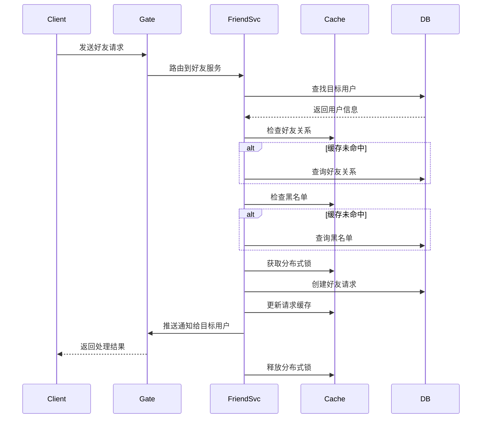
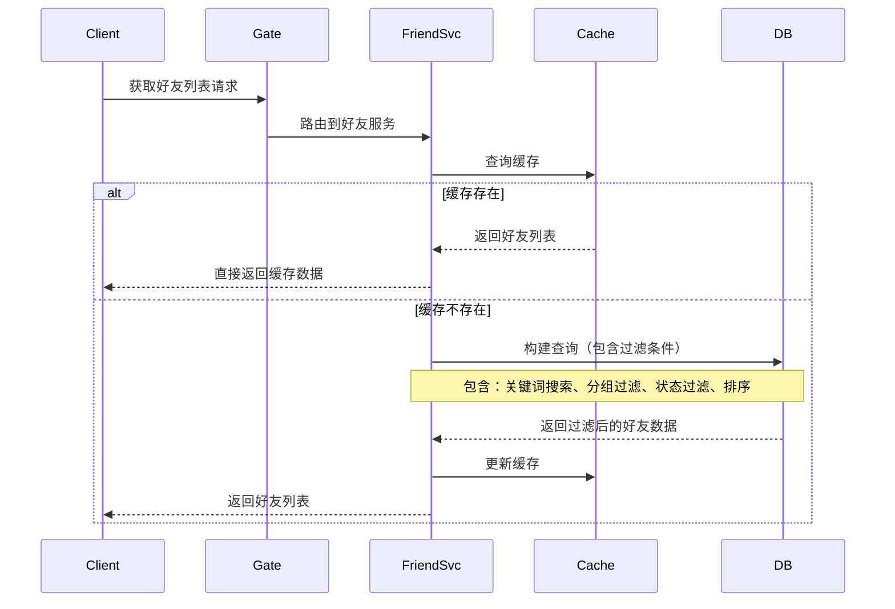
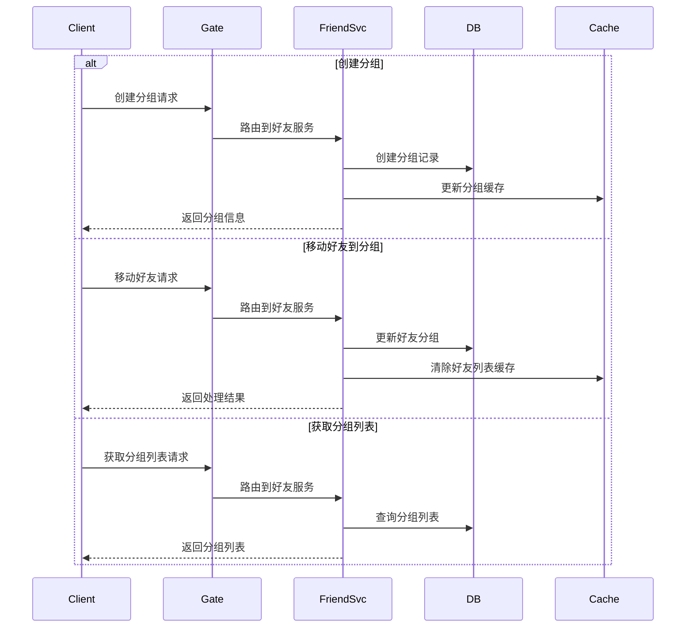
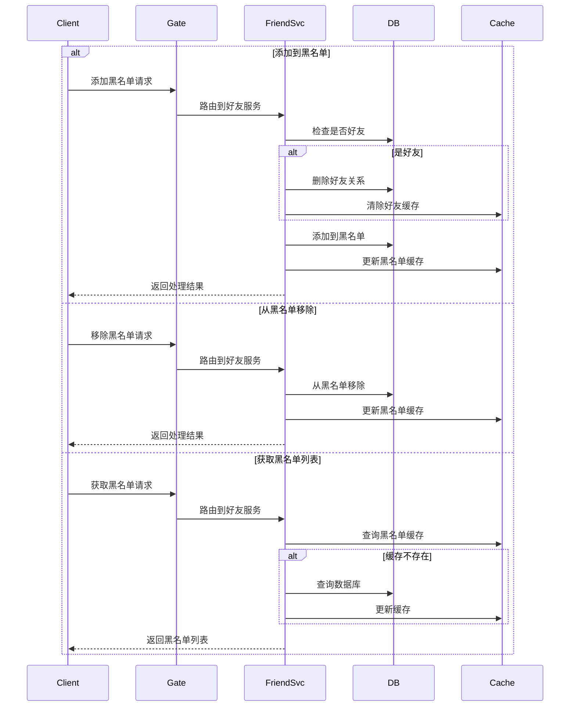
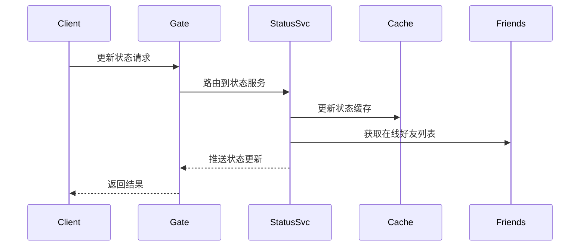
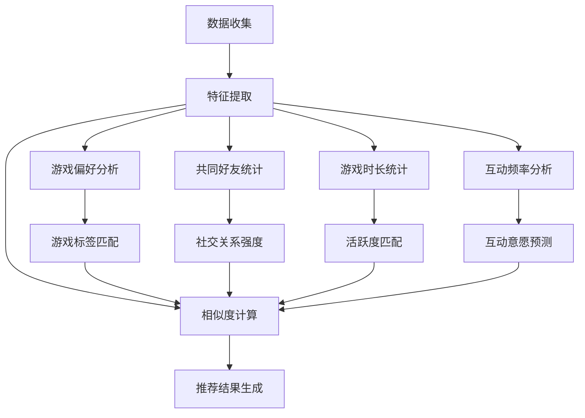

# 游戏好友系统技术设计文档

## 目录

- [1. 通信协议定义 (Protobuf)](#1-通信协议定义-protobuf)
  - [1.1 协议概览](#11-协议概览)
  - [1.2 基础消息定义](#12-基础消息定义)
  - [1.3 好友管理模块](#13-好友管理模块)
  - [1.4 状态管理模块](#14-状态管理模块)
  - [1.5 推荐系统模块](#15-推荐系统模块)
  - [1.6 消息ID定义](#16-消息id定义)
- [2. 数据模型设计](#2-数据模型设计)
  - [2.1 Redis 数据结构设计](#21-redis-数据结构设计)
  - [2.2 数据操作接口](#22-数据操作接口)
  - [2.3 缓存设计](#23-缓存设计)
    - [2.3.1 数据一致性保证](#231-数据一致性保证)
    - [2.3.2 高可用设计](#232-高可用设计)
- [3. 功能实现](#3-功能实现)
  - [3.1 好友管理功能](#31-好友管理功能)
    - [3.1.1 消息ID定义](#311-消息id定义)
    - [3.1.2 好友添加流程](#312-好友添加流程)
    - [3.1.3 好友列表获取流程](#313-好友列表获取流程)
    - [3.1.4 好友分组管理流程](#314-好友分组管理流程)
    - [3.1.5 黑名单管理流程](#315-黑名单管理流程)
  - [3.2 好友状态显示](#32-好友状态显示)
    - [3.2.1 消息ID定义](#321-消息id定义)
    - [3.2.2 状态管理流程](#322-状态管理流程)
  - [3.3 好友推荐](#33-好友推荐)
    - [3.3.1 消息ID定义](#331-消息id定义)
    - [3.3.2 推荐系统流程](#332-推荐系统流程)

## 1. 通信协议定义 (Protobuf)

#### 1.1 协议概览
- **好友管理模块**
  - 好友请求 (1001-1007)
  - 好友分组 (1101-1104)
  - 黑名单管理 (1201-1206)
- **状态管理模块**
  - 状态更新 (2001-2005)
- **推荐系统模块**
  - 好友推荐 (3001-3002)

#### 1.2 基础消息定义
```protobuf
syntax = "proto3";
package friend;

// 好友请求消息
message FriendRequestProto {
    int64 request_id = 1;
    int64 sender_id = 2;
    int64 receiver_id = 3;
    int32 status = 4;      // 0:待处理 1:已接受 2:已拒绝
    int64 created_at = 5;
}

// 好友信息
message FriendInfoProto {
    int64 user_id = 1;
    string username = 2;
    int32 status = 3;      // 1:在线 2:离开 3:繁忙 4:隐身
    string current_game = 4;
    string custom_status = 5;
}

// 好友列表请求
message GetFriendListReq {
    int64 user_id = 1;
    int32 page_size = 2;
    int32 page_num = 3;
}

// 好友列表响应
message GetFriendListResp {
    repeated FriendInfoProto friends = 1;
    int32 total_count = 2;
}

// 添加好友请求
message AddFriendReq {
    int64 user_id = 1;
    int64 friend_id = 2;
    string message = 3;
}

// 添加好友响应
message AddFriendResp {
    bool success = 1;
    string message = 2;
    FriendRequestProto request = 3;
}

// 好友状态变更通知
message FriendStatusNotify {
    int64 user_id = 1;
    int32 status = 2;
    string current_game = 3;
    string custom_status = 4;
    int64 updated_at = 5;
}

// 好友分组信息
message FriendGroupProto {
    int64 group_id = 1;
    int64 user_id = 2;
    string group_name = 3;
    int64 created_at = 4;
}

// 创建分组请求
message CreateGroupReq {
    int64 user_id = 1;
    string group_name = 2;
}

// 创建分组响应
message CreateGroupResp {
    bool success = 1;
    string message = 2;
    FriendGroupProto group = 3;
}

// 移动好友到分组请求
message MoveFriendToGroupReq {
    int64 user_id = 1;
    int64 friend_id = 2;
    int64 group_id = 3;
}

// 移动好友到分组响应
message MoveFriendToGroupResp {
    bool success = 1;
    string message = 2;
}

// 状态更新相关
message UpdateStatusReq {
    int64 user_id = 1;
    int32 status = 2;
    string custom_status = 3;
}

message UpdateStatusResp {
    bool success = 1;
    string message = 2;
}

// 服务定义
service FriendService {
    // 好友管理接口
    rpc GetFriendList(GetFriendListReq) returns (GetFriendListResp);
    rpc AddFriend(AddFriendReq) returns (AddFriendResp);
    
    // 状态管理接口
    rpc UpdateStatus(FriendStatusNotify) returns (google.protobuf.Empty);
    
    // 分组管理接口
    rpc CreateGroup(CreateGroupReq) returns (CreateGroupResp);
    rpc MoveFriendToGroup(MoveFriendToGroupReq) returns (MoveFriendToGroupResp);
}
```

#### 1.3 好友管理模块
```protobuf
// 好友请求相关
message FriendRequestProto {
    int64 request_id = 1;
    int64 sender_id = 2;
    int64 receiver_id = 3;
    int32 status = 4;      // 0:待处理 1:已接受 2:已拒绝
    int64 created_at = 5;
}

message AddFriendReq {
    int64 user_id = 1;
    int64 friend_id = 2;
    string message = 3;
}

message AddFriendResp {
    bool success = 1;
    string message = 2;
    FriendRequestProto request = 3;
}

// 好友分组相关
message FriendGroupProto {
    int64 group_id = 1;
    int64 user_id = 2;
    string group_name = 3;
    int64 created_at = 4;
}

message CreateGroupReq {
    int64 user_id = 1;
    string group_name = 2;
}

message CreateGroupResp {
    bool success = 1;
    string message = 2;
    FriendGroupProto group = 3;
}

message MoveFriendToGroupReq {
    int64 user_id = 1;
    int64 friend_id = 2;
    int64 group_id = 3;
}

message MoveFriendToGroupResp {
    bool success = 1;
    string message = 2;
}
```

#### 1.4 状态管理模块
```protobuf
// 状态更新相关
message FriendStatusNotify {
    int64 user_id = 1;
    int32 status = 2;
    string current_game = 3;
    string custom_status = 4;
    int64 updated_at = 5;
}

message UpdateStatusReq {
    int64 user_id = 1;
    int32 status = 2;
    string custom_status = 3;
}

message UpdateStatusResp {
    bool success = 1;
    string message = 2;
}
```

#### 1.5 推荐系统模块
```protobuf
// 推荐相关消息ID
message GetRecommendationsReq {
    int64 user_id = 1;
}

message GetRecommendationsResp {
    repeated FriendRecommendation recommendations = 1;
}
```

#### 1.6 消息ID定义
```go
const (
    // 好友管理相关消息ID (1001-1007)
    MSG_ID_ADD_FRIEND_REQ         = 1001
    MSG_ID_ADD_FRIEND_RESP        = 1002
    MSG_ID_DEL_FRIEND_REQ         = 1003
    MSG_ID_DEL_FRIEND_RESP        = 1004
    MSG_ID_GET_FRIEND_LIST_REQ    = 1005
    MSG_ID_GET_FRIEND_LIST_RESP   = 1006
    MSG_ID_FRIEND_REQUEST_NOTIFY  = 1007
    
    // 好友分组相关消息ID (1101-1104)
    MSG_ID_CREATE_GROUP_REQ       = 1101
    MSG_ID_CREATE_GROUP_RESP      = 1102
    MSG_ID_MOVE_TO_GROUP_REQ      = 1103
    MSG_ID_MOVE_TO_GROUP_RESP     = 1104
    
    // 黑名单相关消息ID (1201-1206)
    MSG_ID_ADD_BLACKLIST_REQ      = 1201
    MSG_ID_ADD_BLACKLIST_RESP     = 1202
    MSG_ID_DEL_BLACKLIST_REQ      = 1203
    MSG_ID_DEL_BLACKLIST_RESP     = 1204
    MSG_ID_GET_BLACKLIST_REQ      = 1205
    MSG_ID_GET_BLACKLIST_RESP     = 1206
    
    // 状态相关消息ID (2001-2005)
    MSG_ID_UPDATE_STATUS_REQ      = 2001
    MSG_ID_UPDATE_STATUS_RESP     = 2002
    MSG_ID_FRIEND_STATUS_NOTIFY   = 2003
    MSG_ID_GET_FRIEND_STATUS_REQ  = 2004
    MSG_ID_GET_FRIEND_STATUS_RESP = 2005
    
    // 推荐相关消息ID (3001-3002)
    MSG_ID_GET_RECOMMENDATIONS_REQ  = 3001
    MSG_ID_GET_RECOMMENDATIONS_RESP = 3002
)
```

## 2. 数据模型设计

### 2.1 Redis 数据结构设计

```go
const (
    // User Center 公共区域 - 用户基础信息
    KEY_USER_CENTER = "uc:user:{uid}"        // Hash - 用户基本信息(等级、头像、名称等)
    KEY_USER_STATUS = "uc:status:{uid}"      // Hash - 用户状态信息
    KEY_ONLINE_USERS = "uc:online"           // Set - 在线用户集合
    KEY_USERNAME_TO_ID = "uc:name:{name}"    // String - 用户名到ID的映射
    
    // 好友系统
    KEY_FRIEND_HASH = "friend:hash:{uid}"    // Hash - 好友关系(key:好友ID, value:json包含时间和好友度)
    KEY_FRIEND_REQ = "friend:req:{uid}"      // Hash - 好友申请(key:申请者ID, value:json包含时间和消息)
    KEY_BLACKLIST = "friend:black:{uid}"     // Hash - 黑名单(key:目标ID, value:json包含时间和原因)
    
    // 好友分组相关
    KEY_GROUP_LIST = "friend:group:{uid}"    // Hash - 分组列表(key:分组ID, value:分组名称)
    KEY_GROUP_MEMBERS = "friend:gm:{gid}"    // Set - 分组成员ID集合
    
    // 游戏偏好相关(推荐系统用)
    KEY_GAME_PREF = "game:pref:{uid}"       // Sorted Set - 用户游戏偏好,score为游戏时长
    KEY_ACTIVE_TIME = "game:active:{uid}"    // Hash - 用户活跃时间段统计
    
    // ID生成器
    KEY_ID_GENERATOR = "id:gen:{type}"       // String - 各类ID生成器
)

// User Center 数据结构
type UserCenterInfo struct {
    UserID      string `json:"user_id"`
    Username    string `json:"username"`
    Level       int32  `json:"level"`
    Avatar     string `json:"avatar"`
    Title      string `json:"title"`
    VipLevel   int32  `json:"vip_level"`
    LastActive int64  `json:"last_active"`
    CreatedAt  int64  `json:"created_at"`
}

// 好友关系数据
type FriendInfo struct {
    FriendID   string `json:"friend_id"`
    Intimacy   int32  `json:"intimacy"`     // 好友度
    CreateTime int64  `json:"create_time"`
    GroupID    string `json:"group_id,omitempty"`
}

// 好友申请数据
type FriendRequest struct {
    SenderID   string `json:"sender_id"`
    Message    string `json:"message"`
    CreateTime int64  `json:"create_time"`
}

// 黑名单数据
type BlacklistInfo struct {
    TargetID   string `json:"target_id"`
    Reason     string `json:"reason"`
    CreateTime int64  `json:"create_time"`
}

// 数据过期时间
const (
    EXPIRE_USER_INFO = time.Hour * 24 * 7    // 用户信息缓存7天
    EXPIRE_USER_STATUS = time.Minute * 5     // 用户状态缓存5分钟
    EXPIRE_FRIEND_REQ = time.Hour * 24 * 30  // 好友请求保存30天
)

// Redis DAO 接口
type UserCenterDAO interface {
    // 用户基本信息
    GetUserInfo(ctx context.Context, userID string) (*UserCenterInfo, error)
    SetUserInfo(ctx context.Context, info *UserCenterInfo) error
    GetUsersByIDs(ctx context.Context, userIDs []string) ([]*UserCenterInfo, error)
    UpdateUserStatus(ctx context.Context, userID string, status int32) error
}

type FriendDAO interface {
    // 好友关系
    AddFriend(ctx context.Context, userID, friendID string, info *FriendInfo) error
    RemoveFriend(ctx context.Context, userID, friendID string) error
    GetFriendList(ctx context.Context, userID string) (map[string]*FriendInfo, error)
    
    // 好友申请
    CreateFriendRequest(ctx context.Context, userID string, req *FriendRequest) error
    GetFriendRequests(ctx context.Context, userID string) (map[string]*FriendRequest, error)
    
    // 黑名单
    AddToBlacklist(ctx context.Context, userID string, info *BlacklistInfo) error
    RemoveFromBlacklist(ctx context.Context, userID, targetID string) error
    GetBlacklist(ctx context.Context, userID string) (map[string]*BlacklistInfo, error)
}

// Redis Lua 脚本定义
const (
    // 添加好友关系的 Lua 脚本
    ADD_FRIEND_SCRIPT = `
        local userID = KEYS[1]
        local friendID = KEYS[2]
        local friendInfo = ARGV[1]
        
        -- 检查是否已经是好友
        local existingFriend = redis.call('HGET', 'friend:hash:'..userID, friendID)
        if existingFriend then
            return {err = "already friends"}
        end
        
        -- 检查是否在黑名单中
        local isBlocked = redis.call('HGET', 'friend:black:'..userID, friendID)
        if isBlocked then
            return {err = "user is blocked"}
        end
        
        -- 原子性地添加双向好友关系
        redis.call('HSET', 'friend:hash:'..userID, friendID, friendInfo)
        redis.call('HSET', 'friend:hash:'..friendID, userID, friendInfo)
        
        return {ok = 1}
    `
    
    // 更新用户状态的 Lua 脚本
    UPDATE_STATUS_SCRIPT = `
        local userID = KEYS[1]
        local status = ARGV[1]
        local customStatus = ARGV[2]
        local currentGame = ARGV[3]
        
        -- 更新状态
        redis.call('HMSET', 'uc:status:'..userID, 
            'status', status,
            'custom_status', customStatus,
            'current_game', currentGame,
            'updated_at', redis.call('TIME')[1]
        )
        
        -- 更新在线用户集合
        if status == '1' then
            redis.call('SADD', 'uc:online', userID)
        else
            redis.call('SREM', 'uc:online', userID)
        end
        
        -- 获取好友列表用于通知
        return redis.call('HKEYS', 'friend:hash:'..userID)
    `
    
    // 添加到黑名单的 Lua 脚本
    ADD_BLACKLIST_SCRIPT = `
        local userID = KEYS[1]
        local targetID = KEYS[2]
        local reason = ARGV[1]
        
        -- 检查并删除好友关系
        local isFriend = redis.call('HEXISTS', 'friend:hash:'..userID, targetID)
        if isFriend == 1 then
            -- 删除双向好友关系
            redis.call('HDEL', 'friend:hash:'..userID, targetID)
            redis.call('HDEL', 'friend:hash:'..targetID, userID)
        end
        
        -- 添加到黑名单
        local blacklistInfo = string.format('{"target_id":"%s","reason":"%s","create_time":%d}',
            targetID, reason, redis.call('TIME')[1])
        redis.call('HSET', 'friend:black:'..userID, targetID, blacklistInfo)
        
        return {ok = 1}
    `
    
    // 处理好友申请的 Lua 脚本
    HANDLE_FRIEND_REQUEST_SCRIPT = `
        local targetID = KEYS[1]
        local userID = KEYS[2]
        local status = ARGV[1]
        local friendInfo = ARGV[2]
        
        -- 检查请求是否存在
        local req = redis.call('HGET', 'friend:req:'..targetID, userID)
        if not req then
            return {err = "request not found"}
        end
        
        if status == '1' then
            -- 创建好友关系
            redis.call('HSET', 'friend:hash:'..targetID, userID, friendInfo)
            redis.call('HSET', 'friend:hash:'..userID, targetID, friendInfo)
        end
        
        -- 删除请求
        redis.call('HDEL', 'friend:req:'..targetID, userID)
        
        return {ok = 1}
    `
)

// FriendService 结构体增加 Lua 脚本字段
type FriendService struct {
    redis  *redis.Client
    logger *zap.Logger
    
    // Lua 脚本
    addFriendScript        *redis.Script
    updateStatusScript     *redis.Script
    addBlacklistScript    *redis.Script
    handleRequestScript   *redis.Script
}

// 初始化 FriendService
func NewFriendService(redis *redis.Client, logger *zap.Logger) *FriendService {
    return &FriendService{
        redis:  redis,
        logger: logger,
        
        // 初始化 Lua 脚本
        addFriendScript:     redis.NewScript(ADD_FRIEND_SCRIPT),
        updateStatusScript:  redis.NewScript(UPDATE_STATUS_SCRIPT),
        addBlacklistScript: redis.NewScript(ADD_BLACKLIST_SCRIPT),
        handleRequestScript: redis.NewScript(HANDLE_FRIEND_REQUEST_SCRIPT),
    }
}

// 使用 Lua 脚本实现添加好友
func (s *FriendService) AddFriend(ctx context.Context, userID, friendID string, info *FriendInfo) error {
    // 序列化好友信息
    friendInfo, err := json.Marshal(info)
    if err != nil {
        return err
    }
    
    // 执行 Lua 脚本
    result, err := s.addFriendScript.Run(ctx, s.redis,
        []string{userID, friendID},  // keys
        string(friendInfo),          // args
    ).Result()
    
    if err != nil {
        return err
    }
    
    // 处理结果
    res, ok := result.(map[string]interface{})
    if !ok {
        return errors.New("invalid script result")
    }
    
    if errMsg, exists := res["err"]; exists {
        return errors.New(errMsg.(string))
    }
    
    return nil
}

// 使用 Lua 脚本实现状态更新
func (s *FriendService) UpdateStatus(ctx context.Context, userID string, status int32, customStatus, currentGame string) error {
    // 执行 Lua 脚本
    result, err := s.updateStatusScript.Run(ctx, s.redis,
        []string{userID},                              // keys
        strconv.Itoa(int(status)), customStatus, currentGame,  // args
    ).Result()
    
    if err != nil {
        return err
    }
    
    // 获取需要通知的好友列表
    friendIDs, ok := result.([]string)
    if !ok {
        return errors.New("invalid script result")
    }
    
    // 异步发送状态更新通知
    go func() {
        for _, friendID := range friendIDs {
            s.sendStatusNotification(ctx, friendID, &FriendStatusNotify{
                UserID:       userID,
                Status:       status,
                CustomStatus: customStatus,
                CurrentGame:  currentGame,
                UpdatedAt:    time.Now().Unix(),
            })
        }
    }()
    
    return nil
}

// 使用 Lua 脚本实现添加黑名单
func (s *FriendService) AddToBlacklist(ctx context.Context, userID, targetID string, reason string) error {
    // 执行 Lua 脚本
    result, err := s.addBlacklistScript.Run(ctx, s.redis,
        []string{userID, targetID},  // keys
        reason,                      // args
    ).Result()
    
    if err != nil {
        return err
    }
    
    // 处理结果
    res, ok := result.(map[string]interface{})
    if !ok {
        return errors.New("invalid script result")
    }
    
    if errMsg, exists := res["err"]; exists {
        return errors.New(errMsg.(string))
    }
    
    return nil
}

// 使用 Lua 脚本实现处理好友请求
func (s *FriendService) HandleFriendRequest(ctx context.Context, targetID, userID string, status int32) error {
    // 创建好友信息
    friendInfo := &FriendInfo{
        FriendID:   userID,
        CreateTime: time.Now().Unix(),
    }
    
    // 序列化好友信息
    info, err := json.Marshal(friendInfo)
    if err != nil {
        return err
    }
    
    // 执行 Lua 脚本
    result, err := s.handleRequestScript.Run(ctx, s.redis,
        []string{targetID, userID},           // keys
        strconv.Itoa(int(status)), string(info),  // args
    ).Result()
    
    if err != nil {
        return err
    }
    
    // 处理结果
    res, ok := result.(map[string]interface{})
    if !ok {
        return errors.New("invalid script result")
    }
    
    if errMsg, exists := res["err"]; exists {
        return errors.New(errMsg.(string))
    }
    
    return nil
}
```

### 2.2 数据操作接口

```go
// Redis 数据访问接口
type RedisDAO interface {
    // 用户相关
    GetUserInfo(ctx context.Context, userID int64) (*UserInfo, error)
    SetUserInfo(ctx context.Context, user *UserInfo) error
    UpdateUserStatus(ctx context.Context, status *UserStatus) error
    GetOnlineUsers(ctx context.Context) ([]int64, error)
    
    // 好友关系相关
    AddFriend(ctx context.Context, userID, friendID int64) error
    RemoveFriend(ctx context.Context, userID, friendID int64) error
    GetFriendList(ctx context.Context, userID int64) ([]int64, error)
    CreateFriendRequest(ctx context.Context, req *FriendRequest) error
    GetFriendRequests(ctx context.Context, userID int64) ([]*FriendRequest, error)
    
    // 好友分组相关
    CreateGroup(ctx context.Context, group *FriendGroup) error
    AddToGroup(ctx context.Context, groupID int64, memberID int64) error
    RemoveFromGroup(ctx context.Context, groupID int64, memberID int64) error
    GetGroupMembers(ctx context.Context, groupID int64) ([]int64, error)
    
    // 黑名单相关
    AddToBlacklist(ctx context.Context, userID, targetID int64) error
    RemoveFromBlacklist(ctx context.Context, userID, targetID int64) error
    IsInBlacklist(ctx context.Context, userID, targetID int64) (bool, error)
    
    // 游戏偏好相关
    UpdateGamePreference(ctx context.Context, userID, gameID int64, playTime int) error
    GetGamePreferences(ctx context.Context, userID int64) (map[int64]int, error)
    
    // ID生成
    GenerateID(ctx context.Context, idType string) (int64, error)
}

// Redis DAO 实现
type RedisDAOImpl struct {
    redis  *redis.Client
    logger *zap.Logger
}

// ID生成器实现
func (d *RedisDAOImpl) GenerateID(ctx context.Context, idType string) (int64, error) {
    key := fmt.Sprintf(KEY_ID_GENERATOR, idType)
    return d.redis.Incr(ctx, key).Result()
}

// 好友关系实现示例
func (d *RedisDAOImpl) AddFriend(ctx context.Context, userID, friendID int64) error {
    pipe := d.redis.Pipeline()
    
    // 添加到双方的好友集合
    key1 := fmt.Sprintf(KEY_FRIEND_SET, userID)
    key2 := fmt.Sprintf(KEY_FRIEND_SET, friendID)
    pipe.SAdd(ctx, key1, friendID)
    pipe.SAdd(ctx, key2, userID)
    
    _, err := pipe.Exec(ctx)
    return err
}

// 好友分组实现示例
func (d *RedisDAOImpl) AddToGroup(ctx context.Context, groupID int64, memberID int64) error {
    key := fmt.Sprintf(KEY_GROUP_MEMBERS, groupID)
    return d.redis.SAdd(ctx, key, memberID).Err()
}

// 黑名单实现示例
func (d *RedisDAOImpl) IsInBlacklist(ctx context.Context, userID, targetID int64) (bool, error) {
    key := fmt.Sprintf(KEY_BLACKLIST, userID)
    return d.redis.SIsMember(ctx, key, targetID).Result()
}
```

### 2.3 缓存设计

#### 2.3.1 数据一致性保证
1. **分布式锁**
   - 使用 Redis 的 SETNX 实现分布式锁
   - 设置合理的锁超时时间
   - 使用 Lua 脚本保证原子性

2. **原子操作**
   - 使用 Pipeline 批量执行命令
   - 使用 Multi/Exec 事务
   - 关键操作使用 Lua 脚本

3. **数据过期策略**
   - 核心数据永久保存
   - 状态类数据设置合理过期时间
   - 使用定时任务清理过期数据

#### 2.3.2 高可用设计
1. **Redis 集群**
   - 主从复制
   - 哨兵监控
   - 集群分片

2. **故障转移**
   - 自动主从切换
   - 数据自动同步
   - 客户端重试机制

3. **监控告警**
   - 性能监控
   - 容量监控
   - 错误告警

## 3. 功能实现

### 3.1 好友管理功能

#### 3.1.1 消息ID定义
```go
const (
    // 好友管理相关消息ID
    MSG_ID_ADD_FRIEND_REQ         = 1001
    MSG_ID_ADD_FRIEND_RESP        = 1002
    MSG_ID_DEL_FRIEND_REQ         = 1003
    MSG_ID_DEL_FRIEND_RESP        = 1004
    MSG_ID_GET_FRIEND_LIST_REQ    = 1005
    MSG_ID_GET_FRIEND_LIST_RESP   = 1006
    MSG_ID_FRIEND_REQUEST_NOTIFY  = 1007
    
    // 好友分组相关消息ID
    MSG_ID_CREATE_GROUP_REQ       = 1101
    MSG_ID_CREATE_GROUP_RESP      = 1102
    MSG_ID_MOVE_TO_GROUP_REQ      = 1103
    MSG_ID_MOVE_TO_GROUP_RESP     = 1104
    
    // 黑名单相关消息ID
    MSG_ID_ADD_BLACKLIST_REQ      = 1201
    MSG_ID_ADD_BLACKLIST_RESP     = 1202
    MSG_ID_DEL_BLACKLIST_REQ      = 1203
    MSG_ID_DEL_BLACKLIST_RESP     = 1204
    MSG_ID_GET_BLACKLIST_REQ      = 1205
    MSG_ID_GET_BLACKLIST_RESP     = 1206
)
```

#### 3.1.2 好友添加流程



```go
// FriendService 好友管理服务
type FriendService struct {
    redis  *redis.Client
    logger *zap.Logger
    dao    RedisDAO
}

// AddFriend 添加好友
func (s *FriendService) AddFriend(ctx context.Context, userID int64, target string) error {
    // 1. 获取目标用户信息
    var targetID int64
    if id, err := strconv.ParseInt(target, 10, 64); err == nil {
        targetID = id
    } else {
        // 通过用户名查找用户
        key := fmt.Sprintf("user:name:%s", target)
        var err error
        targetID, err = s.redis.Get(ctx, key).Int64()
        if err != nil {
            return errors.New("user not found")
        }
    }
    
    // 2. 检查是否已经是好友
    isFriend, err := s.IsFriend(ctx, userID, targetID)
    if err != nil {
        return err
    }
    if isFriend {
        return errors.New("already friends")
    }
    
    // 3. 检查是否在黑名单中
    isBlocked, err := s.dao.IsInBlacklist(ctx, targetID, userID)
    if err != nil {
        return err
    }
    if isBlocked {
        return errors.New("you are in target's blacklist")
    }
    
    // 4. 创建好友请求
    return s.CreateFriendRequest(ctx, userID, targetID)
}

// IsFriend 检查是否是好友
func (s *FriendService) IsFriend(ctx context.Context, userID, friendID int64) (bool, error) {
    key := fmt.Sprintf(KEY_FRIEND_SET, userID)
    return s.redis.SIsMember(ctx, key, friendID).Result()
}

// CreateFriendRequest 创建好友请求
func (s *FriendService) CreateFriendRequest(ctx context.Context, userID, targetID int64) error {
    // 1. 生成请求ID
    requestID, err := s.dao.GenerateID(ctx, "friend_req")
    if err != nil {
        return err
    }
    
    // 2. 创建请求记录
    req := &FriendRequest{
        RequestID:  requestID,
        SenderID:   userID,
        ReceiverID: targetID,
        Status:     FRIEND_REQUEST_PENDING,
        CreatedAt:  time.Now().Unix(),
    }
    
    // 3. 使用Pipeline批量操作
    pipe := s.redis.Pipeline()
    
    // 保存请求详情
    reqKey := fmt.Sprintf(KEY_FRIEND_REQ, requestID)
    pipe.HMSet(ctx, reqKey, map[string]interface{}{
        "request_id":  requestID,
        "sender_id":   userID,
        "receiver_id": targetID,
        "status":     FRIEND_REQUEST_PENDING,
        "created_at": req.CreatedAt,
    })
    pipe.Expire(ctx, reqKey, EXPIRE_FRIEND_REQ)
    
    // 添加到接收者的请求列表
    inKey := fmt.Sprintf(KEY_FRIEND_REQ_IN, targetID)
    pipe.LPush(ctx, inKey, requestID)
    
    // 添加到发送者的请求列表
    outKey := fmt.Sprintf(KEY_FRIEND_REQ_OUT, userID)
    pipe.LPush(ctx, outKey, requestID)
    
    if _, err := pipe.Exec(ctx); err != nil {
        return err
    }
    
    // 4. 发送通知
    if err := s.sendNotification(ctx, targetID, MSG_ID_FRIEND_REQUEST_NOTIFY, req); err != nil {
        s.logger.Error("failed to send notification", zap.Error(err))
    }
    
    return nil
}

// GetFriendList 获取好友列表
func (s *FriendService) GetFriendList(ctx context.Context, userID int64, opts *FriendSearchOptions) ([]*FriendInfo, error) {
    // 1. 获取好友ID列表
    key := fmt.Sprintf(KEY_FRIEND_SET, userID)
    friendIDs, err := s.redis.SMembers(ctx, key).Result()
    if err != nil {
        return nil, err
    }
    
    if len(friendIDs) == 0 {
        return []*FriendInfo{}, nil
    }
    
    // 2. 批量获取好友信息
    pipe := s.redis.Pipeline()
    infoKeys := make([]string, len(friendIDs))
    statusKeys := make([]string, len(friendIDs))
    
    for i, fid := range friendIDs {
        infoKeys[i] = fmt.Sprintf(KEY_USER_INFO, fid)
        statusKeys[i] = fmt.Sprintf(KEY_USER_STATUS, fid)
        pipe.HGetAll(ctx, infoKeys[i])
        pipe.HGetAll(ctx, statusKeys[i])
    }
    
    results, err := pipe.Exec(ctx)
    if err != nil {
        return nil, err
    }
    
    // 3. 组装好友信息
    friends := make([]*FriendInfo, 0)
    for i := 0; i < len(results); i += 2 {
        info := results[i].(*redis.StringStringMapCmd).Val()
        status := results[i+1].(*redis.StringStringMapCmd).Val()
        
        friend := &FriendInfo{
            UserID:       info["user_id"],
            Username:     info["username"],
            Status:       status["status"],
            CurrentGame:  status["current_game"],
            CustomStatus: status["custom_status"],
        }
        
        // 应用过滤条件
        if s.matchSearchOptions(friend, opts) {
            friends = append(friends, friend)
        }
    }
    
    // 4. 排序
    if opts != nil && opts.SortBy != "" {
        s.sortFriends(friends, opts)
    }
    
    return friends, nil
}

// matchSearchOptions 检查好友信息是否匹配搜索条件
func (s *FriendService) matchSearchOptions(friend *FriendInfo, opts *FriendSearchOptions) bool {
    if opts == nil {
        return true
    }
    
    // 关键词匹配
    if opts.Keyword != "" && !strings.Contains(friend.Username, opts.Keyword) {
        return false
    }
    
    // 状态过滤
    if opts.Status > 0 && friend.Status != opts.Status {
        return false
    }
    
    return true
}

// sortFriends 对好友列表排序
func (s *FriendService) sortFriends(friends []*FriendInfo, opts *FriendSearchOptions) {
    sort.Slice(friends, func(i, j int) bool {
        switch opts.SortBy {
        case "status":
            if opts.SortOrder == "desc" {
                return friends[i].Status > friends[j].Status
            }
            return friends[i].Status < friends[j].Status
        case "username":
            if opts.SortOrder == "desc" {
                return friends[i].Username > friends[j].Username
            }
            return friends[i].Username < friends[j].Username
        default:
            return false
        }
    })
}
```

#### 3.1.3 好友列表获取流程



```go
// 获取好友列表（支持分组和搜索）
func (s *FriendService) GetFriendList(ctx context.Context, userID int64, opts *FriendSearchOptions) (*GetFriendListResp, error) {
    // 1. 尝试从缓存获取完整好友列表
    var friends []*FriendInfoProto
    cacheKey := fmt.Sprintf("friend:list:%d", userID)
    if data, err := s.redis.Get(ctx, cacheKey).Result(); err == nil {
        if err := json.Unmarshal([]byte(data), &friends); err == nil {
            // 对缓存数据应用过滤
            friends = applyFilters(friends, opts)
            return &GetFriendListResp{
                Friends: friends,
                TotalCount: int32(len(friends)),
            }, nil
        }
    }
    
    // 2. 缓存未命中，从数据库查询
    query := s.db.Table("friendships f").
        Joins("JOIN users u ON f.friend_id = u.user_id").
        Where("f.user_id = ?", userID)
    
    // 应用过滤条件
    if opts.Keyword != "" {
        query = query.Where("u.username LIKE ?", "%"+opts.Keyword+"%")
    }
    if opts.GroupID > 0 {
        query = query.Where("f.group_id = ?", opts.GroupID)
    }
    if opts.Status > 0 {
        query = query.Where("u.status_code = ?", opts.Status)
    }
    if opts.SortBy != "" {
        order := opts.SortBy
        if opts.SortOrder == "desc" {
            order += " DESC"
        }
        query = query.Order(order)
    }
    
    if err := query.Find(&friends).Error; err != nil {
        return nil, err
    }
    
    // 3. 更新缓存
    if data, err := json.Marshal(friends); err == nil {
        s.redis.Set(ctx, cacheKey, data, time.Minute*5)
    }
    
    // 对结果应用过滤
    friends = applyFilters(friends, opts)
    
    return &GetFriendListResp{
        Friends: friends,
        TotalCount: int32(len(friends)),
    }, nil
}
```

#### 3.1.4 好友分组管理流程



```go
// FriendGroupService 好友分组服务
type FriendGroupService struct {
    db     *gorm.DB
    redis  *redis.Client
    logger *zap.Logger
}

// CreateGroup 创建好友分组
func (s *FriendGroupService) CreateGroup(ctx context.Context, userID int64, groupName string) (*FriendGroup, error) {
    group := &FriendGroup{
        UserID:    userID,
        GroupName: groupName,
        CreatedAt: time.Now(),
    }
    
    if err := s.db.Create(group).Error; err != nil {
        return nil, err
    }
    
    // 更新缓存
    s.updateGroupCache(ctx, userID)
    return group, nil
}

// updateGroupCache 更新用户的好友分组缓存
func (s *FriendGroupService) updateGroupCache(ctx context.Context, userID int64) error {
    // 1. 从数据库获取最新的分组列表
    var groups []*FriendGroup
    if err := s.db.Where("user_id = ?", userID).Find(&groups).Error; err != nil {
        s.logger.Error("failed to get groups from db",
            zap.Error(err),
            zap.Int64("user_id", userID))
        return err
    }
    
    // 2. 序列化分组数据
    groupData, err := json.Marshal(groups)
    if err != nil {
        s.logger.Error("failed to marshal groups",
            zap.Error(err),
            zap.Int64("user_id", userID))
        return err
    }
    
    // 3. 使用Pipeline批量更新缓存
    pipe := s.redis.Pipeline()
    
    // 更新分组列表缓存
    cacheKey := fmt.Sprintf(CACHE_KEY_FRIEND_GROUPS, userID)
    pipe.Set(ctx, cacheKey, groupData, time.Hour*24)
    
    // 将分组ID添加到用户的分组集合中
    groupSetKey := fmt.Sprintf("user:groups:%d", userID)
    pipe.Del(ctx, groupSetKey)
    for _, group := range groups {
        pipe.SAdd(ctx, groupSetKey, group.GroupID)
    }
    
    // 执行Pipeline操作
    if _, err := pipe.Exec(ctx); err != nil {
        s.logger.Error("failed to update group cache",
            zap.Error(err),
            zap.Int64("user_id", userID))
        return err
    }
    
    return nil
}

// MoveFriendToGroup 移动好友到指定分组
func (s *FriendGroupService) MoveFriendToGroup(ctx context.Context, userID, friendID, groupID int64) error {
    if err := s.db.Model(&Friendship{}).
        Where("user_id = ? AND friend_id = ?", userID, friendID).
        Update("group_id", groupID).Error; err != nil {
        return err
    }
    
    // 更新缓存
    s.redis.Del(ctx, fmt.Sprintf("friend:list:%d", userID))
    return nil
}

// GetGroups 获取用户的好友分组列表
func (s *FriendGroupService) GetGroups(ctx context.Context, userID int64) ([]*FriendGroup, error) {
    var groups []*FriendGroup
    if err := s.db.Where("user_id = ?", userID).Find(&groups).Error; err != nil {
        return nil, err
    }
    return groups, nil
}
```

#### 3.1.5 黑名单管理流程



```go
// AddToBlacklist 添加用户到黑名单
func (s *FriendService) AddToBlacklist(ctx context.Context, userID, targetID int64) error {
    // 1. 获取分布式锁
    lockKey := fmt.Sprintf(CACHE_KEY_LOCK_FRIEND, userID, targetID)
    lock := s.redisLock.NewLock(lockKey, time.Second*30)
    if err := lock.Lock(); err != nil {
        return fmt.Errorf("failed to acquire lock: %w", err)
    }
    defer lock.Unlock()
    
    // 2. 检查是否已经是好友
    if s.IsFriend(ctx, userID, targetID) {
        // 删除好友关系
        if err := s.DeleteFriend(ctx, userID, targetID); err != nil {
            return err
        }
    }
    
    // 3. 添加到黑名单
    blacklist := &Blacklist{
        ID:        generateID(),
        UserID:    userID,
        TargetID:  targetID,
        CreatedAt: time.Now(),
    }
    
    if err := s.db.Create(blacklist).Error; err != nil {
        return err
    }
    
    // 4. 更新缓存
    cacheKey := fmt.Sprintf(CACHE_KEY_BLACKLIST, userID)
    s.redis.SAdd(ctx, cacheKey, targetID)
    
    return nil
}

// RemoveFromBlacklist 从黑名单移除用户
func (s *FriendService) RemoveFromBlacklist(ctx context.Context, userID, targetID int64) error {
    // 1. 获取分布式锁
    lockKey := fmt.Sprintf(CACHE_KEY_LOCK_FRIEND, userID, targetID)
    lock := s.redisLock.NewLock(lockKey, time.Second*30)
    if err := lock.Lock(); err != nil {
        return fmt.Errorf("failed to acquire lock: %w", err)
    }
    defer lock.Unlock()
    
    // 2. 从数据库删除
    if err := s.db.Where("user_id = ? AND target_id = ?", userID, targetID).
        Delete(&Blacklist{}).Error; err != nil {
        return err
    }
    
    // 3. 更新缓存
    cacheKey := fmt.Sprintf(CACHE_KEY_BLACKLIST, userID)
    s.redis.SRem(ctx, cacheKey, targetID)
    
    return nil
}

// GetBlacklist 获取用户的黑名单列表
func (s *FriendService) GetBlacklist(ctx context.Context, userID int64) ([]*UserInfo, error) {
    // 1. 先查缓存
    cacheKey := fmt.Sprintf(CACHE_KEY_BLACKLIST, userID)
    if data, err := s.redis.Get(ctx, cacheKey).Result(); err == nil {
        var users []*UserInfo
        if err := json.Unmarshal([]byte(data), &users); err == nil {
            return users, nil
        }
    }
    
    // 2. 查数据库
    var blacklist []*Blacklist
    if err := s.db.Where("user_id = ?", userID).Find(&blacklist).Error; err != nil {
        return nil, err
    }
    
    // 3. 获取用户信息
    targetIDs := make([]int64, len(blacklist))
    for i, b := range blacklist {
        targetIDs[i] = b.TargetID
    }
    
    var users []*UserInfo
    if err := s.db.Where("user_id IN ?", targetIDs).Find(&users).Error; err != nil {
        return nil, err
    }
    
    // 4. 更新缓存
    if data, err := json.Marshal(users); err == nil {
        s.redis.Set(ctx, cacheKey, data, time.Hour*24)
    }
    
    return users, nil
}

// 处理黑名单相关消息
func (s *FriendService) handleBlacklistMsg(ctx context.Context, session *Session, msgID uint32, data []byte) error {
    switch msgID {
    case MSG_ID_ADD_BLACKLIST_REQ:
        var req struct {
            UserID   int64 `json:"user_id"`
            TargetID int64 `json:"target_id"`
        }
        if err := json.Unmarshal(data, &req); err != nil {
            return err
        }
        return s.AddToBlacklist(ctx, req.UserID, req.TargetID)
        
    case MSG_ID_DEL_BLACKLIST_REQ:
        var req struct {
            UserID   int64 `json:"user_id"`
            TargetID int64 `json:"target_id"`
        }
        if err := json.Unmarshal(data, &req); err != nil {
            return err
        }
        return s.RemoveFromBlacklist(ctx, req.UserID, req.TargetID)
        
    case MSG_ID_GET_BLACKLIST_REQ:
        var req struct {
            UserID int64 `json:"user_id"`
        }
        if err := json.Unmarshal(data, &req); err != nil {
            return err
        }
        users, err := s.GetBlacklist(ctx, req.UserID)
        if err != nil {
            return err
        }
        return session.Send(MSG_ID_GET_BLACKLIST_RESP, users)
        
    default:
        return errors.New("unknown message id")
    }
}
```

### 3.2 好友状态显示

#### 3.2.1 消息ID定义
```go
const (
    // 状态相关消息ID
    MSG_ID_UPDATE_STATUS_REQ      = 2001
    MSG_ID_UPDATE_STATUS_RESP     = 2002
    MSG_ID_FRIEND_STATUS_NOTIFY   = 2003
    MSG_ID_GET_FRIEND_STATUS_REQ  = 2004
    MSG_ID_GET_FRIEND_STATUS_RESP = 2005
)
```

#### 3.2.2 状态管理流程



```go
// StatusManager 在线状态管理器
type StatusManager struct {
    sessions    sync.Map // userID -> *Session
    redis       *redis.Client
    logger      *zap.Logger
}

// OnUserOnline 处理用户上线
func (m *StatusManager) OnUserOnline(session *Session) {
    // 1. 保存会话信息
    m.sessions.Store(session.UserID, session)
    
    // 2. 更新用户状态
    status := &UserStatus{
        UserID:    session.UserID,
        Status:    STATUS_ONLINE,
        UpdatedAt: time.Now().Unix(),
    }
    
    if err := m.updateStatus(session.ctx, status); err != nil {
        m.logger.Error("failed to update status", zap.Error(err))
        return
    }
    
    // 3. 通知好友上线
    friends, _ := m.getFriendIDs(session.UserID)
    for _, friendID := range friends {
        if s, ok := m.sessions.Load(friendID); ok {
            s.(*Session).Send(MSG_ID_FRIEND_STATUS_NOTIFY, &FriendStatusNotify{
                UserID:    session.UserID,
                Status:    STATUS_ONLINE,
                UpdatedAt: status.UpdatedAt,
            })
        }
    }
}

// OnUserOffline 处理用户下线
func (m *StatusManager) OnUserOffline(session *Session) {
    // 1. 移除会话信息
    m.sessions.Delete(session.UserID)
    
    // 2. 更新用户状态
    status := &UserStatus{
        UserID:    session.UserID,
        Status:    STATUS_OFFLINE,
        UpdatedAt: time.Now().Unix(),
    }
    
    if err := m.updateStatus(session.ctx, status); err != nil {
        m.logger.Error("failed to update status", zap.Error(err))
        return
    }
    
    // 3. 通知好友下线
    friends, _ := m.getFriendIDs(session.UserID)
    for _, friendID := range friends {
        if s, ok := m.sessions.Load(friendID); ok {
            s.(*Session).Send(MSG_ID_FRIEND_STATUS_NOTIFY, &FriendStatusNotify{
                UserID:    session.UserID,
                Status:    STATUS_OFFLINE,
                UpdatedAt: status.UpdatedAt,
            })
        }
    }
}

// UpdateStatus 更新用户状态
func (m *StatusManager) UpdateStatus(ctx context.Context, userID int64, status int8, customStatus string) error {
    newStatus := &UserStatus{
        UserID:       userID,
        Status:       status,
        CustomStatus: customStatus,
        UpdatedAt:    time.Now().Unix(),
    }
    
    return m.updateStatus(ctx, newStatus)
}

// updateStatus 内部实现状态更新
func (m *StatusManager) updateStatus(ctx context.Context, status *UserStatus) error {
    // 1. 获取分布式锁
    lockKey := fmt.Sprintf(CACHE_KEY_LOCK_STATUS, status.UserID)
    lock := m.redisLock.NewLock(lockKey, time.Second*30)
    if err := lock.Lock(); err != nil {
        return fmt.Errorf("failed to acquire lock: %w", err)
    }
    defer lock.Unlock()

    // 2. 更新数据库
    if err := m.db.Model(&UserStatus{}).
        Where("user_id = ?", status.UserID).
        Updates(map[string]interface{}{
            "status":        status.Status,
            "custom_status": status.CustomStatus,
            "last_updated":  time.Now(),
        }).Error; err != nil {
        return fmt.Errorf("failed to update status in db: %w", err)
    }

    // 3. 更新Redis缓存
    cacheKey := fmt.Sprintf(CACHE_KEY_USER_STATUS, status.UserID)
    statusData, err := json.Marshal(status)
    if err != nil {
        return fmt.Errorf("failed to marshal status: %w", err)
    }

    // 使用Pipeline批量执行Redis操作
    pipe := m.redis.Pipeline()
    
    // 更新状态详情
    pipe.Set(ctx, cacheKey, statusData, CACHE_EXPIRE_USER_STATUS)
    
    // 更新在线用户集合
    if status.Status == STATUS_ONLINE {
        pipe.SAdd(ctx, CACHE_KEY_ONLINE_USERS, status.UserID)
    } else {
        pipe.SRem(ctx, CACHE_KEY_ONLINE_USERS, status.UserID)
    }
    
    if _, err := pipe.Exec(ctx); err != nil {
        return fmt.Errorf("failed to update redis cache: %w", err)
    }

    // 4. 获取好友列表并发送通知
    friends, err := m.getFriendIDs(status.UserID)
    if err != nil {
        m.logger.Error("failed to get friend ids", 
            zap.Error(err),
            zap.Int64("user_id", status.UserID))
        return nil // 不中断状态更新流程
    }

    // 5. 异步发送状态更新通知
    go func() {
        for _, friendID := range friends {
            if session, ok := m.sessions.Load(friendID); ok {
                session.(*Session).Send(MSG_ID_FRIEND_STATUS_NOTIFY, &FriendStatusNotify{
                    UserID:       status.UserID,
                    Status:       status.Status,
                    CurrentGame:  status.CurrentGame,
                    CustomStatus: status.CustomStatus,
                    UpdatedAt:    status.UpdatedAt,
                })
            }
        }
    }()

    return nil
}

// getFriendIDs 获取用户的好友ID列表
func (m *StatusManager) getFriendIDs(userID int64) ([]int64, error) {
    // 1. 先查缓存
    cacheKey := fmt.Sprintf(CACHE_KEY_FRIEND_LIST, userID)
    if data, err := m.redis.Get(context.Background(), cacheKey).Result(); err == nil {
        var friends []int64
        if err := json.Unmarshal([]byte(data), &friends); err == nil {
            return friends, nil
        }
    }

    // 2. 查数据库
    var friendships []Friendship
    if err := m.db.Where("user_id = ?", userID).Find(&friendships).Error; err != nil {
        return nil, err
    }

    // 3. 提取好友ID
    friendIDs := make([]int64, len(friendships))
    for i, f := range friendships {
        friendIDs[i] = f.FriendID
    }

    // 4. 更新缓存
    if data, err := json.Marshal(friendIDs); err == nil {
        m.redis.Set(context.Background(), cacheKey, data, CACHE_EXPIRE_FRIEND_LIST)
    }

    return friendIDs, nil
}
```

### 3.3 好友推荐

#### 3.3.1 消息ID定义
```go
const (
    // 推荐相关消息ID
    MSG_ID_GET_RECOMMENDATIONS_REQ  = 3001
    MSG_ID_GET_RECOMMENDATIONS_RESP = 3002
)
```

#### 3.3.2 推荐系统流程



```go
// RecommendationService 好友推荐服务
type RecommendationService struct {
    redis  *redis.Client
    logger *zap.Logger
}

// GetRecommendations 获取好友推荐
func (s *RecommendationService) GetRecommendations(ctx context.Context, userID int64) ([]*FriendRecommendation, error) {
    // 1. 获取用户的游戏偏好
    userPrefKey := fmt.Sprintf(KEY_GAME_PREF, userID)
    userPrefs, err := s.redis.ZRangeWithScores(ctx, userPrefKey, 0, -1).Result()
    if err != nil {
        return nil, err
    }
    
    // 2. 获取用户的好友集合
    friendKey := fmt.Sprintf(KEY_FRIEND_SET, userID)
    friends, err := s.redis.SMembers(ctx, friendKey).Result()
    if err != nil {
        return nil, err
    }
    
    // 3. 获取用户的活跃时间
    activeKey := fmt.Sprintf(KEY_ACTIVE_TIME, userID)
    activeTime, err := s.redis.HGetAll(ctx, activeKey).Result()
    if err != nil {
        return nil, err
    }
    
    // 4. 查找相似用户
    recommendations := make([]*FriendRecommendation, 0)
    
    // 4.1 基于游戏偏好查找
    for _, pref := range userPrefs {
        gameID := pref.Member.(string)
        // 获取玩这个游戏的其他用户
        gamePlayers := fmt.Sprintf("game:players:%s", gameID)
        players, err := s.redis.ZRangeWithScores(ctx, gamePlayers, 0, 50).Result()
        if err != nil {
            continue
        }
        
        for _, player := range players {
            targetID := player.Member.(string)
            // 排除自己和已经是好友的用户
            if targetID == strconv.FormatInt(userID, 10) || s.isInList(targetID, friends) {
                continue
            }
            
            score := s.calculateGameSimilarity(userPrefs, targetID)
            if score > 0.5 { // 设置一个相似度阈值
                rec := &FriendRecommendation{
                    UserID: targetID,
                    Score:  score,
                    Reason: "你们玩相似的游戏",
                }
                recommendations = append(recommendations, rec)
            }
        }
    }
    
    // 4.2 基于共同好友推荐
    for _, friend := range friends {
        friendsKey := fmt.Sprintf(KEY_FRIEND_SET, friend)
        friendOfFriends, err := s.redis.SMembers(ctx, friendsKey).Result()
        if err != nil {
            continue
        }
        
        for _, fof := range friendOfFriends {
            if fof == strconv.FormatInt(userID, 10) || s.isInList(fof, friends) {
                continue
            }
            
            commonFriends := s.getCommonFriends(userID, fof)
            if len(commonFriends) >= 2 { // 至少有2个共同好友
                rec := &FriendRecommendation{
                    UserID: fof,
                    Score:  float64(len(commonFriends)) * 0.1,
                    Reason: fmt.Sprintf("你们有%d个共同好友", len(commonFriends)),
                }
                recommendations = append(recommendations, rec)
            }
        }
    }
    
    // 4.3 基于活跃时间推荐
    onlineUsers, err := s.redis.SMembers(ctx, KEY_ONLINE_USERS).Result()
    if err == nil {
        for _, online := range onlineUsers {
            if online == strconv.FormatInt(userID, 10) || s.isInList(online, friends) {
                continue
            }
            
            targetActiveKey := fmt.Sprintf(KEY_ACTIVE_TIME, online)
            targetActive, err := s.redis.HGetAll(ctx, targetActiveKey).Result()
            if err != nil {
                continue
            }
            
            overlap := s.calculateTimeOverlap(activeTime, targetActive)
            if overlap > 0.3 { // 设置时间重叠阈值
                rec := &FriendRecommendation{
                    UserID: online,
                    Score:  overlap,
                    Reason: "你们经常在相同时间在线",
                }
                recommendations = append(recommendations, rec)
            }
        }
    }
    
    // 5. 排序和去重
    recommendations = s.deduplicateAndSort(recommendations)
    
    // 6. 获取推荐用户的详细信息
    return s.enrichRecommendations(ctx, recommendations[:min(10, len(recommendations))]), nil
}

// 辅助方法
func (s *RecommendationService) isInList(target string, list []string) bool {
    for _, item := range list {
        if item == target {
            return true
        }
    }
    return false
}

func (s *RecommendationService) calculateGameSimilarity(userPrefs []redis.Z, targetID string) float64 {
    // 实现游戏偏好相似度计算
    return 0.0
}

func (s *RecommendationService) getCommonFriends(userID int64, targetID string) []string {
    // 实现共同好友计算
    return nil
}

func (s *RecommendationService) calculateTimeOverlap(time1, time2 map[string]string) float64 {
    // 实现活跃时间重叠度计算
    return 0.0
}

func (s *RecommendationService) deduplicateAndSort(recommendations []*FriendRecommendation) []*FriendRecommendation {
    // 实现去重和排序
    return recommendations
}

func (s *RecommendationService) enrichRecommendations(ctx context.Context, recommendations []*FriendRecommendation) []*FriendRecommendation {
    // 补充用户详细信息
    return recommendations
}
```
