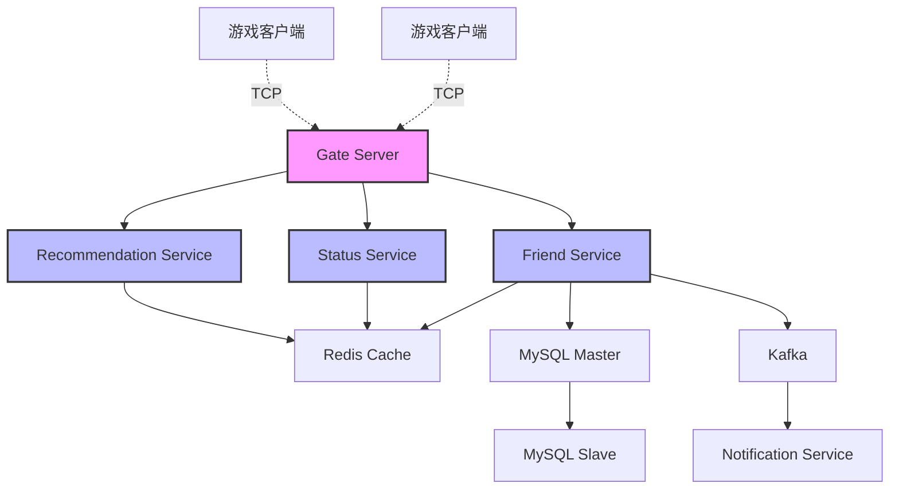
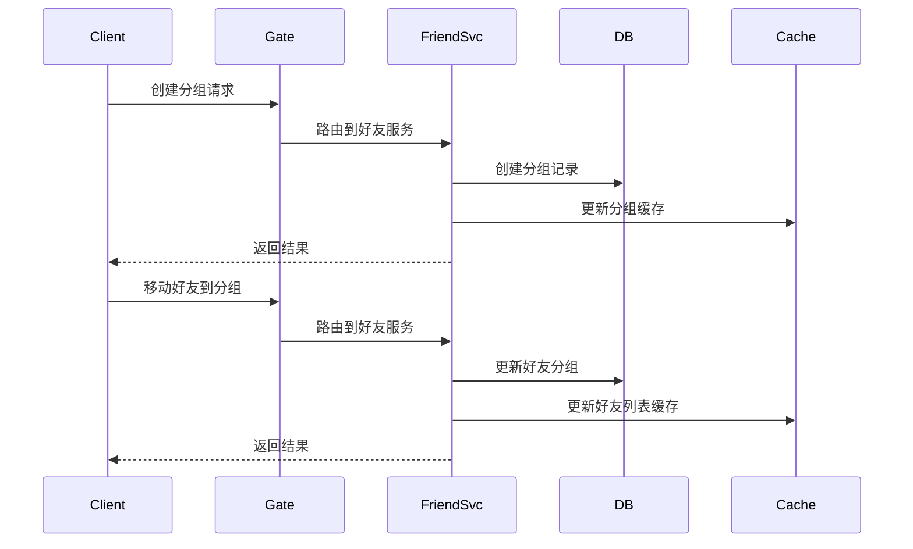
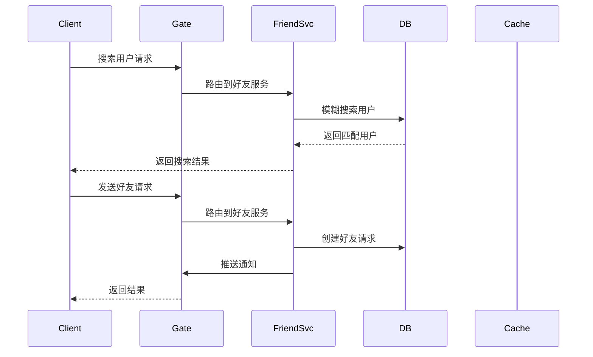

# 游戏好友系统技术设计文档

## 1. 系统架构

### 1.1 整体架构
系统采用分布式架构，使用 Golang 作为主要开发语言，基于 TCP 长连接和 Protobuf 协议通信，整体架构如下：



### 1.2 核心组件
1. **Gate Server**: TCP 网关服务器，负责维护客户端连接和消息路由
2. **Friend Service**: 好友关系管理核心服务
3. **Status Service**: 在线状态管理服务
4. **Recommendation Service**: 好友推荐服务
5. **Cache Layer**: 使用 Redis 集群作为缓存层
6. **Message Queue**: 使用 Kafka 作为消息队列

### 1.3 通信协议定义 (Protobuf)

```protobuf
syntax = "proto3";
package friend;

// 好友请求消息
message FriendRequestProto {
    int64 request_id = 1;
    int64 sender_id = 2;
    int64 receiver_id = 3;
    int32 status = 4;      // 0:待处理 1:已接受 2:已拒绝
    int64 created_at = 5;
}

// 好友信息
message FriendInfoProto {
    int64 user_id = 1;
    string username = 2;
    int32 status = 3;      // 1:在线 2:离开 3:繁忙 4:隐身
    string current_game = 4;
    string custom_status = 5;
}

// 好友列表请求
message GetFriendListReq {
    int64 user_id = 1;
    int32 page_size = 2;
    int32 page_num = 3;
}

// 好友列表响应
message GetFriendListResp {
    repeated FriendInfoProto friends = 1;
    int32 total_count = 2;
}

// 添加好友请求
message AddFriendReq {
    int64 user_id = 1;
    int64 friend_id = 2;
    string message = 3;
}

// 添加好友响应
message AddFriendResp {
    bool success = 1;
    string message = 2;
    FriendRequestProto request = 3;
}

// 好友状态变更通知
message FriendStatusNotify {
    int64 user_id = 1;
    int32 status = 2;
    string current_game = 3;
    string custom_status = 4;
    int64 updated_at = 5;
}

// 服务定义
service FriendService {
    rpc GetFriendList(GetFriendListReq) returns (GetFriendListResp);
    rpc AddFriend(AddFriendReq) returns (AddFriendResp);
    rpc UpdateStatus(FriendStatusNotify) returns (google.protobuf.Empty);
}
```

### 1.4 网关服务实现

```go
// GateServer TCP网关服务器
type GateServer struct {
    listener   net.Listener
    sessions   sync.Map // 保存所有的客户端连接
    router     *Router  // 消息路由器
    friendSvc  *FriendService
    statusSvc  *StatusService
}

// Session 客户端会话
type Session struct {
    conn      net.Conn
    userID    int64
    writeChan chan []byte
    ctx       context.Context
    cancel    context.CancelFunc
}

// 处理客户端连接
func (s *GateServer) handleConnection(conn net.Conn) {
    session := NewSession(conn)
    defer session.Close()

    // 读取消息循环
    for {
        // 1. 读取消息头（长度+消息ID）
        header, err := readHeader(conn)
        if err != nil {
            return
        }

        // 2. 读取消息体
        data, err := readBody(conn, header.Length)
        if err != nil {
            return
        }

        // 3. 根据消息ID路由到对应的处理器
        if err := s.router.Route(session, header.MsgID, data); err != nil {
            log.Printf("Route message error: %v", err)
        }
    }
}

// 发送消息到客户端
func (s *Session) Send(msgID uint32, msg proto.Message) error {
    data, err := proto.Marshal(msg)
    if err != nil {
        return err
    }

    // 构造消息包（头部+消息体）
    packet := NewPacket(msgID, data)
    
    // 异步发送
    select {
    case s.writeChan <- packet:
        return nil
    case <-s.ctx.Done():
        return errors.New("session closed")
    }
}
```

## 2. 数据模型设计

### 2.1 数据库表结构

```sql
-- 用户基础信息表
CREATE TABLE users (
    user_id BIGINT PRIMARY KEY,
    username VARCHAR(50) NOT NULL,
    status_code TINYINT DEFAULT 1,  -- 1:在线 2:离开 3:繁忙 4:隐身
    last_active TIMESTAMP,
    created_at TIMESTAMP DEFAULT CURRENT_TIMESTAMP,
    INDEX idx_username (username),
    INDEX idx_status (status_code)
);

-- 好友关系表
CREATE TABLE friendships (
    id BIGINT PRIMARY KEY,
    user_id BIGINT NOT NULL,
    friend_id BIGINT NOT NULL,
    group_id BIGINT,
    created_at TIMESTAMP DEFAULT CURRENT_TIMESTAMP,
    UNIQUE KEY unique_friendship (user_id, friend_id),
    INDEX idx_user_id (user_id),
    INDEX idx_friend_id (friend_id)
);

-- 好友分组表
CREATE TABLE friend_groups (
    group_id BIGINT PRIMARY KEY,
    user_id BIGINT NOT NULL,
    group_name VARCHAR(50) NOT NULL,
    created_at TIMESTAMP DEFAULT CURRENT_TIMESTAMP,
    INDEX idx_user_id (user_id)
);

-- 好友请求表
CREATE TABLE friend_requests (
    request_id BIGINT PRIMARY KEY,
    sender_id BIGINT NOT NULL,
    receiver_id BIGINT NOT NULL,
    status TINYINT DEFAULT 0,  -- 0:待处理 1:已接受 2:已拒绝
    created_at TIMESTAMP DEFAULT CURRENT_TIMESTAMP,
    INDEX idx_sender (sender_id),
    INDEX idx_receiver (receiver_id),
    INDEX idx_status (status)
);

-- 用户状态表
CREATE TABLE user_status (
    user_id BIGINT PRIMARY KEY,
    current_game VARCHAR(100),
    custom_status VARCHAR(200),
    last_updated TIMESTAMP,
    INDEX idx_last_updated (last_updated)
);
```

### 2.2 数据结构定义 (Golang)

```go
// 用户信息
type User struct {
    UserID    int64     `json:"user_id"`
    Username  string    `json:"username"`
    Status    int8      `json:"status"`
    LastActive time.Time `json:"last_active"`
    CreatedAt time.Time `json:"created_at"`
}

// 好友关系
type Friendship struct {
    ID        int64     `json:"id"`
    UserID    int64     `json:"user_id"`
    FriendID  int64     `json:"friend_id"`
    GroupID   int64     `json:"group_id"`
    CreatedAt time.Time `json:"created_at"`
}

// 好友请求
type FriendRequest struct {
    RequestID  int64     `json:"request_id"`
    SenderID   int64     `json:"sender_id"`
    ReceiverID int64     `json:"receiver_id"`
    Status     int8      `json:"status"`
    CreatedAt  time.Time `json:"created_at"`
}
```

### 2.3 缓存设计
使用 Redis 作为缓存系统：


## 3. 核心功能实现

### 3.1 消息ID定义

```go
const (
    // 好友相关消息ID
    MSG_ID_GET_FRIEND_LIST_REQ    = 1001
    MSG_ID_GET_FRIEND_LIST_RESP   = 1002
    MSG_ID_ADD_FRIEND_REQ         = 1003
    MSG_ID_ADD_FRIEND_RESP        = 1004
    MSG_ID_DEL_FRIEND_REQ         = 1005
    MSG_ID_DEL_FRIEND_RESP        = 1006
    MSG_ID_FRIEND_STATUS_NOTIFY   = 1007
    
    // 黑名单相关消息ID
    MSG_ID_ADD_BLACKLIST_REQ      = 1101
    MSG_ID_ADD_BLACKLIST_RESP     = 1102
    MSG_ID_DEL_BLACKLIST_REQ      = 1103
    MSG_ID_DEL_BLACKLIST_RESP     = 1104
    MSG_ID_GET_BLACKLIST_REQ      = 1105
    MSG_ID_GET_BLACKLIST_RESP     = 1106
)
```

### 3.2 消息处理器实现

```go
// FriendHandler 好友相关消息处理器
type FriendHandler struct {
    friendSvc  *FriendService
    statusSvc  *StatusService
    logger     *zap.Logger
}

// 处理获取好友列表请求
func (h *FriendHandler) HandleGetFriendList(session *Session, msg *GetFriendListReq) error {
    resp, err := h.friendSvc.GetFriendList(session.ctx, msg.UserId, msg.PageSize, msg.PageNum)
    if err != nil {
        return err
    }
    
    // 通过 TCP 连接发送响应
    return session.Send(MSG_ID_GET_FRIEND_LIST_RESP, resp)
}

// 处理添加好友请求
func (h *FriendHandler) HandleAddFriend(session *Session, msg *AddFriendReq) error {
    // 1. 检查是否在黑名单中
    if h.friendSvc.IsInBlacklist(session.ctx, msg.FriendId, msg.UserId) {
        return session.Send(MSG_ID_ADD_FRIEND_RESP, &AddFriendResp{
            Success: false,
            Message: "对方已将您加入黑名单",
        })
    }
    
    // 2. 创建好友请求
    request, err := h.friendSvc.CreateFriendRequest(session.ctx, msg.UserId, msg.FriendId)
    if err != nil {
        return err
    }
    
    // 3. 如果对方在线，推送通知
    if targetSession := h.getOnlineSession(msg.FriendId); targetSession != nil {
        targetSession.Send(MSG_ID_FRIEND_REQUEST_NOTIFY, &FriendRequestNotify{
            Request: request,
        })
    }
    
    return session.Send(MSG_ID_ADD_FRIEND_RESP, &AddFriendResp{
        Success: true,
        Request: request,
    })
}
```

### 3.3 好友服务实现

```go
// FriendService 好友服务
type FriendService struct {
    db         *gorm.DB
    redis      *redis.Client
    logger     *zap.Logger
}

// GetFriendList 获取好友列表
func (s *FriendService) GetFriendList(ctx context.Context, userID int64, pageSize, pageNum int32) (*GetFriendListResp, error) {
    // 1. 尝试从缓存获取
    cacheKey := fmt.Sprintf("friend:list:%d", userID)
    if data, err := s.redis.Get(ctx, cacheKey).Result(); err == nil {
        var resp GetFriendListResp
        if err := json.Unmarshal([]byte(data), &resp); err == nil {
            return &resp, nil
        }
    }
    
    // 2. 从数据库查询
    var friends []Friendship
    offset := (pageNum - 1) * pageSize
    if err := s.db.Where("user_id = ?", userID).
        Offset(int(offset)).
        Limit(int(pageSize)).
        Find(&friends).Error; err != nil {
        return nil, err
    }
    
    // 3. 查询好友详细信息
    resp := &GetFriendListResp{
        Friends: make([]*FriendInfoProto, 0, len(friends)),
    }
    
    for _, f := range friends {
        info, err := s.getUserInfo(ctx, f.FriendID)
        if err != nil {
            continue
        }
        resp.Friends = append(resp.Friends, info)
    }
    
    // 4. 更新缓存
    if data, err := json.Marshal(resp); err == nil {
        s.redis.Set(ctx, cacheKey, data, time.Minute*5)
    }
    
    return resp, nil
}

// IsInBlacklist 检查是否在黑名单中
func (s *FriendService) IsInBlacklist(ctx context.Context, userID, targetID int64) bool {
    cacheKey := fmt.Sprintf("blacklist:%d", userID)
    return s.redis.SIsMember(ctx, cacheKey, targetID).Val()
}

// AddToBlacklist 添加到黑名单
func (s *FriendService) AddToBlacklist(ctx context.Context, userID, targetID int64) error {
    // 1. 添加到数据库
    blacklist := &Blacklist{
        UserID:    userID,
        TargetID:  targetID,
        CreatedAt: time.Now(),
    }
    
    if err := s.db.Create(blacklist).Error; err != nil {
        return err
    }
    
    // 2. 更新缓存
    cacheKey := fmt.Sprintf("blacklist:%d", userID)
    s.redis.SAdd(ctx, cacheKey, targetID)
    
    // 3. 如果是好友关系，则删除好友关系
    if err := s.db.Where("user_id = ? AND friend_id = ?", userID, targetID).
        Or("user_id = ? AND friend_id = ?", targetID, userID).
        Delete(&Friendship{}).Error; err != nil {
        s.logger.Error("failed to delete friendship", zap.Error(err))
    }
    
    // 4. 删除好友缓存
    s.redis.Del(ctx, fmt.Sprintf("friend:list:%d", userID))
    s.redis.Del(ctx, fmt.Sprintf("friend:list:%d", targetID))
    
    return nil
}
```

### 3.4 在线状态管理

```go
// StatusManager 在线状态管理器
type StatusManager struct {
    sessions    sync.Map // userID -> *Session
    redis       *redis.Client
    logger      *zap.Logger
}

// OnUserOnline 处理用户上线
func (m *StatusManager) OnUserOnline(session *Session) {
    // 1. 保存会话信息
    m.sessions.Store(session.UserID, session)
    
    // 2. 更新用户状态
    status := &UserStatus{
        UserID:    session.UserID,
        Status:    STATUS_ONLINE,
        UpdatedAt: time.Now().Unix(),
    }
    
    if err := m.updateStatus(session.ctx, status); err != nil {
        m.logger.Error("failed to update status", zap.Error(err))
        return
    }
    
    // 3. 通知好友上线
    friends, _ := m.getFriendIDs(session.UserID)
    for _, friendID := range friends {
        if s, ok := m.sessions.Load(friendID); ok {
            s.(*Session).Send(MSG_ID_FRIEND_STATUS_NOTIFY, &FriendStatusNotify{
                UserID:    session.UserID,
                Status:    STATUS_ONLINE,
                UpdatedAt: status.UpdatedAt,
            })
        }
    }
}

// OnUserOffline 处理用户下线
func (m *StatusManager) OnUserOffline(session *Session) {
    // 1. 移除会话信息
    m.sessions.Delete(session.UserID)
    
    // 2. 更新用户状态
    status := &UserStatus{
        UserID:    session.UserID,
        Status:    STATUS_OFFLINE,
        UpdatedAt: time.Now().Unix(),
    }
    
    if err := m.updateStatus(session.ctx, status); err != nil {
        m.logger.Error("failed to update status", zap.Error(err))
        return
    }
    
    // 3. 通知好友下线
    friends, _ := m.getFriendIDs(session.UserID)
    for _, friendID := range friends {
        if s, ok := m.sessions.Load(friendID); ok {
            s.(*Session).Send(MSG_ID_FRIEND_STATUS_NOTIFY, &FriendStatusNotify{
                UserID:    session.UserID,
                Status:    STATUS_OFFLINE,
                UpdatedAt: status.UpdatedAt,
            })
        }
    }
}
```

### 3.5 黑名单数据结构

```protobuf
// 黑名单相关消息
message BlacklistUserInfo {
    int64 user_id = 1;
    string username = 2;
    int64 created_at = 3;
}

message AddToBlacklistReq {
    int64 user_id = 1;
    int64 target_id = 2;
}

message AddToBlacklistResp {
    bool success = 1;
    string message = 2;
}

message GetBlacklistReq {
    int64 user_id = 1;
    int32 page_size = 2;
    int32 page_num = 3;
}

message GetBlacklistResp {
    repeated BlacklistUserInfo users = 1;
    int32 total_count = 2;
}
```

```sql
-- 黑名单表
CREATE TABLE blacklist (
    id BIGINT PRIMARY KEY AUTO_INCREMENT,
    user_id BIGINT NOT NULL,
    target_id BIGINT NOT NULL,
    created_at TIMESTAMP DEFAULT CURRENT_TIMESTAMP,
    UNIQUE KEY unique_blacklist (user_id, target_id),
    INDEX idx_user_id (user_id),
    INDEX idx_target_id (target_id)
);
```

### 3.6 好友搜索和排序

```go
// FriendSearchOptions 好友搜索选项
type FriendSearchOptions struct {
    Keyword    string    // 搜索关键词
    GroupID    int64     // 分组ID
    Status     int8      // 在线状态
    SortBy     string    // 排序字段：last_active, username
    SortOrder  string    // 排序顺序：asc, desc
}

// SearchFriends 搜索好友
func (s *FriendService) SearchFriends(ctx context.Context, userID int64, opts *FriendSearchOptions) ([]*FriendInfoProto, error) {
    query := s.db.Table("friendships f").
        Joins("JOIN users u ON f.friend_id = u.user_id").
        Where("f.user_id = ?", userID)
    
    // 关键词搜索
    if opts.Keyword != "" {
        query = query.Where("u.username LIKE ?", "%"+opts.Keyword+"%")
    }
    
    // 分组过滤
    if opts.GroupID > 0 {
        query = query.Where("f.group_id = ?", opts.GroupID)
    }
    
    // 状态过滤
    if opts.Status > 0 {
        query = query.Where("u.status_code = ?", opts.Status)
    }
    
    // 排序
    if opts.SortBy != "" {
        order := opts.SortBy
        if opts.SortOrder == "desc" {
            order += " DESC"
        }
        query = query.Order(order)
    }
    
    var friends []*FriendInfoProto
    if err := query.Find(&friends).Error; err != nil {
        return nil, err
    }
    
    return friends, nil
}
```

### 3.7 好友分组管理



```go
// FriendGroupService 好友分组服务
type FriendGroupService struct {
    db     *gorm.DB
    redis  *redis.Client
    logger *zap.Logger
}

// CreateGroup 创建好友分组
func (s *FriendGroupService) CreateGroup(ctx context.Context, userID int64, groupName string) (*FriendGroup, error) {
    group := &FriendGroup{
        UserID:    userID,
        GroupName: groupName,
        CreatedAt: time.Now(),
    }
    
    if err := s.db.Create(group).Error; err != nil {
        return nil, err
    }
    
    // 更新缓存
    s.updateGroupCache(ctx, userID)
    return group, nil
}

// MoveFriendToGroup 移动好友到指定分组
func (s *FriendGroupService) MoveFriendToGroup(ctx context.Context, userID, friendID, groupID int64) error {
    if err := s.db.Model(&Friendship{}).
        Where("user_id = ? AND friend_id = ?", userID, friendID).
        Update("group_id", groupID).Error; err != nil {
        return err
    }
    
    // 更新缓存
    s.redis.Del(ctx, fmt.Sprintf("friend:list:%d", userID))
    return nil
}
```

### 3.8 好友推荐系统


```go
// RecommendationService 好友推荐服务
type RecommendationService struct {
    db     *gorm.DB
    redis  *redis.Client
    logger *zap.Logger
}

// RecommendationReason 推荐原因
type RecommendationReason struct {
    Type        string  // 推荐类型：common_friends, similar_games, active_time
    Score       float64 // 相似度得分
    Description string  // 推荐原因描述
}

// FriendRecommendation 好友推荐
type FriendRecommendation struct {
    User    *UserInfo
    Reasons []*RecommendationReason
    Score   float64
}

// GetRecommendations 获取好友推荐
func (s *RecommendationService) GetRecommendations(ctx context.Context, userID int64) ([]*FriendRecommendation, error) {
    // 1. 获取用户特征
    userFeatures, err := s.getUserFeatures(ctx, userID)
    if err != nil {
        return nil, err
    }
    
    // 2. 获取候选用户
    candidates, err := s.getCandidateUsers(ctx, userID)
    if err != nil {
        return nil, err
    }
    
    // 3. 计算相似度和推荐原因
    recommendations := make([]*FriendRecommendation, 0)
    for _, candidate := range candidates {
        // 计算共同好友
        commonFriends, err := s.getCommonFriends(ctx, userID, candidate.UserID)
        if err != nil {
            continue
        }
        
        // 计算游戏偏好相似度
        gameSimilarity, err := s.calculateGameSimilarity(ctx, userID, candidate.UserID)
        if err != nil {
            continue
        }
        
        // 计算活跃时间重叠度
        activeTimeOverlap, err := s.calculateActiveTimeOverlap(ctx, userID, candidate.UserID)
        if err != nil {
            continue
        }
        
        // 生成推荐原因
        reasons := []*RecommendationReason{
            {
                Type:        "common_friends",
                Score:       float64(len(commonFriends)) * 0.4,
                Description: fmt.Sprintf("有%d个共同好友", len(commonFriends)),
            },
            {
                Type:        "similar_games",
                Score:       gameSimilarity * 0.4,
                Description: "有相似的游戏兴趣",
            },
            {
                Type:        "active_time",
                Score:       activeTimeOverlap * 0.2,
                Description: "经常在相同时间在线",
            },
        }
        
        // 计算总分
        totalScore := 0.0
        for _, reason := range reasons {
            totalScore += reason.Score
        }
        
        recommendations = append(recommendations, &FriendRecommendation{
            User:    candidate,
            Reasons: reasons,
            Score:   totalScore,
        })
    }
    
    // 4. 排序
    sort.Slice(recommendations, func(i, j int) bool {
        return recommendations[i].Score > recommendations[j].Score
    })
    
    return recommendations[:min(10, len(recommendations))], nil
}
```

### 3.9 通过用户名添加好友



```go
// SearchUsers 搜索用户
func (s *FriendService) SearchUsers(ctx context.Context, keyword string) ([]*UserInfo, error) {
    var users []*UserInfo
    if err := s.db.Where("username LIKE ?", "%"+keyword+"%").
        Limit(20).
        Find(&users).Error; err != nil {
        return nil, err
    }
    return users, nil
}

// AddFriendByUsername 通过用户名添加好友
func (s *FriendService) AddFriendByUsername(ctx context.Context, userID int64, username string) error {
    // 1. 查找目标用户
    var target User
    if err := s.db.Where("username = ?", username).First(&target).Error; err != nil {
        return err
    }
    
    // 2. 检查是否已经是好友
    if s.IsFriend(ctx, userID, target.UserID) {
        return errors.New("already friends")
    }
    
    // 3. 创建好友请求
    return s.CreateFriendRequest(ctx, userID, target.UserID)
}
```

## 4. 性能优化策略

### 4.1 缓存策略


### 4.2 数据库优化
1. **分库分表策略**：
   - 按用户ID范围水平分片
   - 使用一致性哈希算法
   - 预留分片扩展空间

2. **索引优化**：
   - 为高频查询字段建立索引
   - 避免过度索引
   - 定期维护索引统计信息

### 4.3 并发处理

```go
// 使用分布式锁处理并发
func (s *FriendService) AddFriend(ctx context.Context, userID, friendID int64) error {
    // 获取分布式锁
    lockKey := fmt.Sprintf("lock:friend:add:%d:%d", userID, friendID)
    lock := s.redisLock.NewLock(lockKey, time.Second*30)
    
    if err := lock.Lock(); err != nil {
        return fmt.Errorf("failed to acquire lock: %w", err)
    }
    defer lock.Unlock()

    // 处理好友添加逻辑
    return s.processFriendAdd(ctx, userID, friendID)
}
```

## 5. 监控告警

### 5.1 监控指标
1. **系统性能指标**
   - QPS
   - 响应时间
   - 错误率
   - Goroutine 数量

2. **业务指标**
   - 好友添加成功率
   - 推荐准确率
   - 消息投递成功率

### 5.2 告警策略


## 6. 部署架构


## 7. 扩展性设计

1. **服务无状态化**
   - 所有服务实例无状态
   - 支持水平扩展
   - 使用服务发现

2. **接口版本控制**
   - URL 版本号
   - 向下兼容
   - 平滑升级策略

3. **跨区域部署**
   - 多区域数据同步
   - 就近访问策略
   - 容灾备份方案

## 8. 开发规范

1. **代码规范**
   - 遵循 Golang 官方规范
   - 统一错误处理
   - 完善的注释文档

2. **API 规范**
   - RESTful API 设计
   - 统一响应格式
   - 请求参数验证

3. **日志规范**
   - 统一日志格式
   - 分级日志
   - 链路追踪
